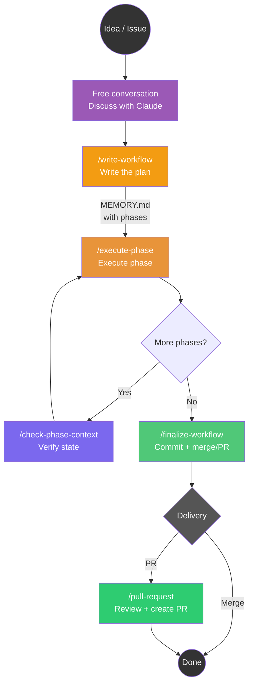
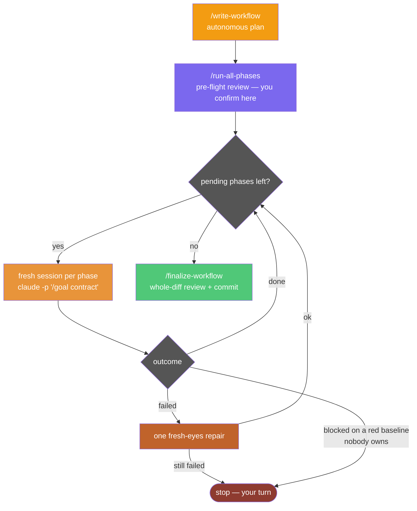

# Claude Code Phased Workflow

A slash command system for Claude Code that structures development work into planned phases, executable in independent sessions, with shared state on the file system.

It runs in two modes, and the choice is about **who the verifier is**:

- **Supervised** — `/execute-phase`, one phase per chat, you verify. For UI work, exploration, decisions that only emerge while doing.
- **Autonomous** — `/run-all-phases` loops one fresh session per phase, each under a native `/goal` contract, with a convergence loop, an independent read-only reviewer, and one fresh-eyes repair attempt on failure. For phases whose feedback signal is machine-checkable: measurable `Done:`, runnable tests, decisions already made in the plan.

A vague phase fails autonomously on the best model in the world; a well-specified phase runs autonomously even on sonnet. See [docs/loop-engineering.md](docs/loop-engineering.md) for why the commands are shaped the way they are.

## The Pattern: Converse, Plan, Execute, Verify, Finalize



> **Note:** `/create-context` is **not required** to use the workflow. It creates an isolated worktree, which is useful when you need to **parallelize** multiple tasks on the same repo. For a single task, just work directly on your branch.

The autonomous path replaces the middle of that diagram with a loop that runs unattended:



---

## Why This Approach?

### The Problem: Context Window Limits

Claude Code operates within a finite context window. Long sessions lead to:

- Lost decisions from earlier in the conversation
- Repeated analysis of the same code
- Progressive quality degradation

### The Solution: File-Based State, Disposable Sessions

1. **Discuss freely** with Claude — no special format required
2. **Crystallize the plan** into `MEMORY.md` with `/write-workflow`
3. **Execute each phase in a dedicated chat** — fresh, full context every time
4. **Finalize** with a single clean commit, then PR or merge

`MEMORY.md` is the coordination point between sessions.

---

## Commands

### Core workflow (works anywhere)

| Command | When to use | What it does |
|---------|------------|--------------|
| `/write-workflow` | After discussing the plan | Writes MEMORY.md from the conversation — pattern references and pre-made decisions per phase |
| `/execute-phase` | Executing a phase | Runs the next phase from the plan: one approval gate up front, then no interruptions |
| `/check-phase-context` | Checking progress | Read-only analysis of plan vs git state |
| `/finalize-workflow` | All phases done | Whole-diff pre-commit review + single clean commit + offers PR or merge |
| `/pull-request` | Creating a PR | Rigorous code review + PR creation |

### Autonomous execution (self-correcting loops)

| Command | When to use | What it does |
|---------|------------|--------------|
| `/auto-phase` | One phase, unattended | Like `/execute-phase` with no confirmations: convergence loop (3 attempts against tests + lint, no-progress detector), independent review, `Done:` gate |
| `/run-all-phases` | The whole plan, unattended | Pre-flight review, then one fresh `/goal`-guarded session per phase; light mode for `Effort=low`; one repair attempt on failure before stopping |
| `/repair-phase` | A phase came back failed | Fresh-eyes repair: reads the `> Issue:` and `> Attempted:` notes, may not repeat a listed attempt, restarts from the diagnosis |

### Context management (optional — for parallelization)

| Command | When to use | What it does |
|---------|------------|--------------|
| `/create-context <topic>` | Need isolated workspace | Creates branch + worktree + VS Code from any branch |
| `/close-context` | Done with a worktree | Close and optionally remove a worktree context |
| `/clean-contexts` | Housekeeping | List and remove stale worktree contexts |

### Auxiliary

| Command | When to use | What it does |
|---------|------------|--------------|
| `/issue <number>` | Starting from a GitHub issue | Loads and analyzes it — analysis only, the plan comes from `/write-workflow` |
| `/clean-memories` | Housekeeping | List and delete old memory files |

Every command declares its own `allowed-tools`, and the test suite fails if a skill instructs a command its allowlist does not permit — see [Tests](#tests).

---

## Typical Flow

### Simple (no worktree)

Work directly on your branch — ideal for a single task at a time.

```bash
claude
# Discuss the work freely with Claude...
# When the plan is clear:
> /write-workflow

# Execute phases (new chat for each — fresh context)
> /execute-phase    # Phase 1
> /execute-phase    # Phase 2

# Finalize
> /finalize-workflow
> /pull-request
```

### Isolated (with worktree)

Use when you need to **parallelize** multiple tasks on the same repo. Each worktree has its own branch, files, and MEMORY.md.

```bash
# 1. Create a workspace (from any branch)
> /create-context add PDF export for invoices

# 2. Enter the worktree and start a Claude session
cd .claude/worktrees/feat-add-pdf-export && claude

# 3. Discuss, then crystallize the plan
> /write-workflow

# 4. Execute phases (new chat for each)
> /execute-phase

# 5. Finalize and close
> /finalize-workflow
> /close-context
```

### Autonomous

Ask `/write-workflow` for an autonomous plan: it applies stricter rules — measurable `Done:` criteria (they become the loop's exit condition), every judgment call settled during planning, a pattern reference per phase.

```bash
claude
# Discuss the work, then:
> /write-workflow          # say you want an autonomous plan
> /run-all-phases          # pre-flight review, you confirm, then it runs

# Come back later:
#   every phase [x]        -> /finalize-workflow
#   a phase left [!]       -> read its > Issue:/> Attempted: notes, then
#                             /repair-phase (a second repair is deliberate,
#                             not automatic)
#   a phase left [~]       -> a red baseline nobody owns: fix it, then relaunch
```

For plans beyond ~8-10 phases, or when a phase's shape depends on an earlier phase's *outcome*, `/write-workflow` splits the work into macro-phases: only the first is detailed, the rest stay as inert `## Roadmap` bullets. Each macro gets its own `/run-all-phases` + `/finalize-workflow`, and the next `/write-workflow` re-plans with hindsight. The macro loop is deliberately manual — its boundary is where human judgment pays most, before errors compound.

---

## How Each Command Works

### `/create-context <topic>` — Create Workspace (optional)

Creates the infrastructure for an isolated work stream. **Not required** — use it when you need to parallelize multiple tasks on the same repo.

- Works from **any branch** — the current branch becomes the "parent"
- Creates a **new branch** from the topic (e.g., "fix login timeout" → `fix-login-timeout`)
- Creates an isolated **worktree** in `.claude/worktrees/<name>/`
- Opens **VS Code** on the worktree directory (with a unique title bar color)
- Saves the parent branch in `.claude/parent-branch`

**No planning happens here.** After creating the workspace, enter the worktree and talk to Claude.

### Free Conversation — Natural Planning

After `/create-context`, open a terminal in the worktree:
```bash
cd .claude/worktrees/feat-add-pdf-export && claude
```

Talk to Claude naturally: describe what you want, explore the code together, discuss approaches. No required format, no special commands — just a normal chat.

### `/write-workflow` — Crystallize the Plan

When the discussion is mature, run this command. Claude:

1. Synthesizes the conversation into **objective + concrete phases**
2. Presents the plan for approval
3. Writes `MEMORY.md` with phases, involved files, and execution config

**Output:** a `MEMORY.md` file:

```markdown
# Context: feat-add-pdf-export
Parent: develop | Issue: #42

## Objective
Add PDF export capability for invoices...

## Work Plan
- [ ] **Phase 1**: Create PDF generator service
  - Details: ...
  - Files: src/services/pdf.py
- [ ] **Phase 2**: Add export endpoint
  - Details: ...
  - Files: src/api/invoices.py

## Suggested execution config
| Phase | Effort | Model |
|-------|--------|-------|
| Phase 1 | high | opus |
| Phase 2 | medium | sonnet |
```

The `Parent:` field is critical — it tells `/finalize-workflow` where to merge or create a PR.

### `/execute-phase` — Execute One Phase

Runs **one phase** per chat session.

Key behaviors:
- **One phase per chat** — always-fresh context
- **Never commits** (except WIP safety commit when context runs low)
- **Human verification** — waits for the user to confirm before marking done
- **Records modified files** in the `> Files:` line — source of truth for finalize

### `/auto-phase`, `/run-all-phases`, `/repair-phase` — Unattended Execution

`/auto-phase` is `/execute-phase` with the confirmations removed and the verification loops turned up:

1. **Baseline first.** Tests and linter run *before* the first edit. A phase that inherits someone else's breakage would otherwise attribute it to itself and spend its whole fix budget — plus a repair session — on a bug it did not cause.
2. **Convergence loop.** Tests and lint, fix, repeat — **max 3 attempts**, with an early stop when the same failure signature (same failing test, same exception) appears twice. Iterating blindly against the same error is how naive loops burn budget.
3. **Independent verification.** A read-only `phase-verifier` subagent, in its own context window, gets the `Done:` criterion and the pattern reference. Mechanical findings are fixed in-loop; judgment findings become `> Review:` notes for the human at finalize.
4. **`Done:` gate.** Every criterion from the plan is re-run literally. "Tests pass" is weaker than the plan's own `Done:`, and it is the `Done:` that closes the phase.

`/run-all-phases` is the loop around it — a bash script, so it consumes no model itself:

- **The `/goal` guard** (Claude Code ≥ 2.1.139). Each phase and repair session is launched as `claude -p "/goal <contract>"`. The native goal loop adds an independent per-turn evaluator: a fresh, lighter model reads the transcript and decides whether the exit is genuine, so a premature "I'm done" gets sent back to work. A 25-turn clause bounds the loop. Older CLIs are detected at runtime and fall back to the plain skill prompt — everything still works, without the evaluator.
- **Light mode** for `Effort=low` phases: a slim `/goal` contract (~450 chars against the ~9.5KB skill body) carrying every chain invariant itself. Measured on the seeded fixture: same external outcomes, ~37% cheaper and ~60% of the wall time.
- **Repair is automatic, once.** A phase that exits `[!]` gets one fresh-eyes repair session (fable, opus fallback) launched by the loop; the run continues only if the repair turns the phase `[x]`. The `> Repair attempted:` note makes it idempotent — relaunching does not spend a second repair on the same phase. Delete that note to grant another round after intervening by hand.
- **Red-baseline attribution.** When the baseline check finds tests or lint already red, the failure is matched against the `> Files:` notes of completed phases. *Case A* — a `[x]` phase owns those files: it regressed and was closed wrongly, so it is **reopened `[x] → [!]`** and the ordinary repair path handles it; the run continues. *Case B* — nobody owns it: it pre-dates the run, and the pending phase goes `[~]` for the human. Ambiguity resolves to Case B, because a wrong reopen spends a phase's only repair on the wrong bug.
- **Bounded everywhere.** 3 fix attempts per phase, 1 repair per phase, 25 turns per contract, a notional dollar cap per session (doubled for fable, 250 for `xhigh`), and a no-progress guard that stops a run that is not moving.

Model tiers are guidance, not constraint: strong models go where judgment happens, the medium tier executes with an automatic verifier behind it. The `phase-verifier` is pinned to opus rather than inherited — on a sonnet phase an inherited verifier is as weak as the executor it is meant to check. Full map in [docs/loop-engineering.md](docs/loop-engineering.md).

### `/check-phase-context` — Supervision

Read-only analysis of the plan vs actual code state. Detects drift, oversized phases, and proposes re-phasing. Does not touch source code.

### `/finalize-workflow` — Finalize

When all phases are complete:

1. Verifies all phases are `[x]`
2. Builds the workflow file list
3. In a worktree: `git add -A` (everything belongs to this workflow)
4. Creates a single clean commit
5. **Offers three options:**
   - **Pull request** — push and create PR toward the parent branch
   - **Merge on parent** — direct merge on the parent branch, then optionally remove the worktree
   - **Just commit** — leave as-is

The merge option is designed for the **long feature with parallel sub-tasks** pattern.

**After finalizing:** run `/close-context` to clean up the worktree, or do it after creating the PR with `/pull-request`. Either way, the worktree stays on disk until you explicitly remove it.

### `/pull-request` — Code Review + PR

Acts as a meticulous maintainer: checks issue coherence, code quality, comments in English, security. Blocks the PR with a detailed report if problems are found.

### `/close-context` — Close Worktree

Close the current worktree context. Must be run from inside a worktree. Removes the worktree directory and closes the VS Code window. **The git branch is NOT deleted** — it stays available for PRs, merges, or future work.

Options:

- **Close and remove** — remove worktree + close VS Code (recommended)
- **Close and keep** — return to the main repo, worktree stays on disk
- **Cancel** — stay in the context

Always warns about uncommitted changes and unpushed commits before removing. Branch cleanup happens separately via `/clean-contexts` after merging.

### `/clean-contexts` — Housekeeping

List all worktree contexts with their status (merged, completed, orphaned) and let the user select which ones to remove. Detects orphaned directories and shows disk space freed after cleanup.

---

## Parallel Sub-Tasks

The most powerful pattern: a large feature that requires parallel work streams.


Each worktree:
1. Has its own isolated `MEMORY.md`
2. Has its own VS Code window (different title bar color)
3. Can be worked on independently
4. Merges back to the parent feature branch when done

Conflicts between sub-tasks emerge at merge time — exactly like in a human team, but with full visibility.

---

## Key Design Decisions

### Why worktrees?

Git worktrees create isolated working directories on separate branches. Each worktree has its own file tree, so parallel workflows don't interfere. `git add -A` in a worktree is safe — everything there belongs to that workflow.

### Why no commit during phases?

`/execute-phase` never commits (except a WIP safety commit when context runs low). This gives `/finalize-workflow` full control over the final commit — one clean commit per workflow, with a proper message.

### Why a separate `/write-workflow` command?

Planning is a natural conversation. Forcing it into a structured command felt rigid. Now you just talk to Claude, then `/write-workflow` captures the result. The plan comes from the discussion, not from a template.

### Why merge instead of cherry-pick?

When finalizing a sub-task worktree, merging the feature branch into the parent is cleaner than cherry-picking. It preserves history, avoids duplicate commits, and makes the merge visible in `git log`.

---

## MEMORY.md Format

```markdown
# Context: <branch-name>
Parent: <parent-branch> | Issue: #<number>

## Objective
[2-3 sentences describing the goal]

## Work Plan
- [ ] **Phase 1**: <title>
  - Pattern reference: <existing file:symbol to copy-adapt>
  - Decisions: <the calls settled during planning>
  - Details: <what to do>
  - Files: <involved files>
  - Done: <re-runnable checks — this is the loop's exit condition>
- [x] **Phase 2**: <title>
  > Done: what was accomplished, and how it was demonstrated
  > Files: path/to/file1.py, path/to/file2.py

## Notes
[Constraints, dependencies, attention points]

## Suggested execution config
| Phase | Effort | Model |
|-------|--------|-------|
| Phase 1 | medium | sonnet |
```

Autonomous plans add a `Mode: autonomous` header, and ambitious ones a `## Roadmap` section whose bullets are inert — the launcher never executes them, it only reminds you they are pending.

### Phase States

- `[ ]` — to do
- `[x]` — done: `Done:` criterion demonstrated and externally green (must have a `> Files:` line)
- `[!]` — failed with the bounded fix attempts exhausted — `/repair-phase` handles it, once
- `[~]` — blocked on a red baseline no completed phase owns: the chain has no mandate over it, so it goes to the human
- `[>]` — in progress / resumable, reported as a resume candidate when no pending phase is eligible

### Note Fields

Every state transition leaves machine-readable evidence — this is what makes fresh-eyes repair and the knowledge harvest at finalize possible.

| Field | Meaning |
|-------|---------|
| `> Done:` | what was accomplished and how it was demonstrated |
| `> Files:` | files touched — the basis for attributing a later regression |
| `> Issue:` | why the phase failed |
| `> Attempted:` | attempts already made; a repair may not repeat one |
| `> Repaired:` | root cause, plus *why the earlier attempts missed it* |
| `> Review:` | judgment-level finding from the independent verification, for finalize |
| `> Blocked:` | the failure signature behind a `[~]` |

---

## Strengths

### 1. Always-Fresh Context
Each phase starts with a new chat. No degradation, no compaction, no "forgot what it was doing." The plan on file is the durable memory.

### 2. Git Checkpoints
Each finalized workflow = a clean commit. You can `git log` to reconstruct what happened, rollback, or resume from any point.

### 3. Model Flexibility
The `Suggested execution config` table sets model and effort per phase, decided by the pre-flight review rather than by a blanket rule:
- **opus** is the default and the answer whenever in doubt — and the **floor for anything touching UI or declarative code**, where the output is poorly testable and the loops can't catch much
- **sonnet** is the rare exception: mechanical work only — renames, extractions, moves — or an implementation that merely follows a cited pattern with a test-enforced `Done:`. Marking a phase `sonnet` is a commitment about the *plan*, not the model: whatever the skill no longer spells out, that phase must. If you can't write it that way, leave it opus
- **fable** for genuinely hard phases, and for repair — by definition the phase's own model already failed once, and nobody is watching

The stronger the verification loops, the cheaper the executor can be. The economics still bite, though: a sonnet phase that fails costs a fable repair, so sonnet pays only where first-pass success is likely.

Effort follows the same logic, with a twist specific to this chain. Anthropic's guidance is to stop reaching for `xhigh` reflexively and sweep downward, because `low` and `medium` punch well above their weight on current models — and here that applies harder than usual: a phase that passed the pre-flight is *well-specified by construction*, so high effort gets spent re-exploring and re-verifying decisions the plan already settled. Start low, climb only where real design judgment survives inside the phase, and treat `max` as practically never (it overthinks). Effort levels copied from an older plan rarely transfer.

The same reasoning removed a step: `/auto-phase` no longer sends every phase to an independent verifier. Current models verify their own work as they go, and telling them to verify again produces re-litigation rather than findings. The verifier now runs only where it earns its keep — a `sonnet` phase, a `new-pattern` phase, or a repair, where the code already failed once. The `Done:` gate still runs on every phase: that is a contract check against a criterion the executor did not write, which is a different thing from re-reading your own work.

### 4. The Human Moves to the Edges
Autonomous does not mean unsupervised — it means the supervision is concentrated where it pays:
- Plan approval (`/write-workflow`) — the plan is the loop's contract
- Pre-flight confirmation (`/run-all-phases`) — before any session starts
- The macro-phase boundary on ambitious plans
- `/finalize-workflow`, where the whole-diff review happens, and any phase left `[!]` or `[~]`

Inside those edges the machine self-corrects. Outside them nothing is committed without you: `/finalize-workflow` is the only command that commits.

### 5. Parallel Workflows
Two approaches:
- **With worktrees** (recommended for parallelization): `/create-context` for each task. Each worktree has its own MEMORY.md, VS Code window, and branch.
- **Without worktrees**: if `MEMORY.md` is already occupied, `/write-workflow` creates a parallel plan in `memory_<name>.md`.

### 6. Full Traceability
Everything is traceable: plan in a versionable file, single clean commit per workflow, structured PR template, `/check-phase-context` reconstructs state at any time.

---

## Getting Started

### Prerequisites
- [Claude Code](https://claude.com/claude-code) installed — **≥ 2.1.139** for the `/goal` guard and light mode on autonomous sessions (older versions are detected at runtime and fall back to plain skill prompts)
- Git repository with remote configured
- GitHub CLI (`gh`) installed and authenticated
- (Optional) VS Code with `code` in PATH

### Installation

**Option A — Install from marketplace (recommended):**

Add the marketplace and install the plugin directly from Claude Code:
```bash
claude plugin marketplace add fporcari/claude-phased-workflow
claude plugin install phased-workflow@fporcari/claude-phased-workflow
```

Or from inside a Claude Code session:
```
/plugin marketplace add fporcari/claude-phased-workflow
/plugin install phased-workflow
```

**Option B — Install for a specific project:**

Add to your project's `.claude/settings.json`:
```json
{
  "plugins": {
    "marketplaces": ["fporcari/claude-phased-workflow"],
    "installed": ["phased-workflow@fporcari/claude-phased-workflow"]
  }
}
```

**Option C — From a clone:**
```bash
git clone https://github.com/fporcari/claude-phased-workflow.git
claude plugin marketplace add ./claude-phased-workflow
claude plugin install phased-workflow@claude-phased-workflow
bash claude-phased-workflow/plugins/phased-workflow/install.sh
```

> **Do not copy the skills into `~/.claude/commands/`.** That was the pre-3.0 install and it is now actively harmful: personal commands are flat and unnamespaced, so they collide with your other skills — and worse, a stale `~/.claude/commands/write-workflow.md` wins the bare `/write-workflow` over the plugin's copy, so you keep running an old version without noticing. Installed as a plugin, the skills are namespaced `/phased-workflow:<name>` and *cannot* conflict with any other level; the bare `/<name>` also works whenever nothing else claims it.
>
> Coming from a flat install? Run `install.sh` **after** installing the plugin: it moves the superseded files to `~/.claude/phased-workflow-superseded-commands/` (moves, never deletes) and touches only the 13 names this plugin owns. Run before the plugin is installed, it detects the situation and leaves everything alone — those files are your only working copy until the plugin is there.

**The support files are not optional.** Whichever option you pick, run the plugin's `install.sh` (marketplace installs do not run it for you) to place them under `~/.claude`:

| File | Role |
|------|------|
| `scripts/next-phase.py` | Deterministic phase selection — same inputs, same phase |
| `scripts/run-all-phases.sh` | The autonomous phase loop — executed by the skill, never read into context |
| `agents/phase-verifier.md` | Read-only subagent, for the phases where independent review still earns its keep |
| `workflow-refs/common.md` | Shared conventions, single source of truth for the skills |
| `workflow-refs/write-workflow-autonomous.md` | Autonomous-plan addendum (macro-phases, model tiers, `Done:` rules) |

Without them the chain runs degraded: phase selection falls back to reading the plan by hand, and the independent reviewer to a generic read-only subagent.

**Inside Softwell:** the same set is published to the Sourcerer KB topic `Crew/Workflow/Phased Workflow`, which also carries entries that have no counterpart here. Ask Claude, in a session with the Sourcerer MCP connected, to follow the *Install Phased Workflow Plugin* skill in that topic — it installs and updates commands and support files in one step, frontmatter included. The repo stays the source of truth; `tools/kb-sync.py` keeps the KB in step with it (`--audit` reports anything unmapped in either direction).

### First Use

```bash
claude
# Discuss your task with Claude, then:
> /write-workflow
# New chat for each phase:
> /execute-phase
# When all phases are done:
> /finalize-workflow
```

---

## FAQ

**Q: Can I use `/execute-phase` without `/write-workflow`?**
No. The command looks for a `MEMORY.md` with phases to execute.

**Q: What if the session gets too long?**
`/execute-phase` monitors context proactively. It proposes a WIP safety commit and suggests a new chat.

**Q: Can I skip or reorder phases?**
Yes. The plan is Markdown — edit it. `/check-phase-context` verifies consistency.

**Q: Does `/create-context` only work from develop?**
No — any branch. The current branch becomes the parent. This enables parallel sub-tasks.

**Q: Is VS Code required?**
No. The worktree is created regardless. Use any editor.

**Q: Do I need `/create-context` to use the workflow?**
No. `/create-context` is optional — it creates an isolated worktree, which is useful for parallelizing multiple tasks. For a single task, just work directly on your branch. The entire workflow (`/write-workflow` → `/execute-phase` → `/finalize-workflow`) works without worktrees.

**Q: Does the repair run by itself, or do I launch it?**
By itself, inside `/run-all-phases`: a phase that exits `[!]` gets one repair session automatically, and the loop continues if it succeeds. You launch `/repair-phase` by hand only when the run already stopped (the automatic repair failed), when you are using `/auto-phase` on its own without the launcher, or when you want a different model or effort than the launcher would pick.

**Q: Which phases can actually run unattended?**
The ones whose feedback signal is machine-checkable: a `Done:` you could re-run yourself, tests that exist, decisions already settled in the plan, and a pattern reference to copy-adapt. Everything verified by eye — UI, visual output, exploratory work — belongs to `/execute-phase`. The leash reflects the nature of the phase, not the quality of the model.

**Q: Can it commit or push without me?**
No. `/finalize-workflow` is the only command that commits, and it asks before doing so. Phase sessions never commit (except a WIP safety commit when context runs low).

**Q: How do I clean up old worktrees?**
Use `/clean-contexts` from the main repo. It lists all worktrees with their status and lets you select which to remove. Or use `/close-context` from inside a specific worktree.

---

## Tests

```bash
bash tests/orchestration/run_tests.sh     # free: no sessions, no model
```

**62 assertions over 16 scenarios.** S1–S13 extract the `/run-all-phases` bash script from its own `SKILL.md` and run it against a mock `claude` binary: `/goal` call shape, model/effort/cap selection, repair succeeding and resuming the loop, repair failing and stopping it, the idempotent repair marker, relaunch on a `[!]` *without* that marker, attribution Case A (a reopened phase drops the done-count without tripping the progress guard) and Case B (`[~]` stops the run), fable→opus fallback on a session crash, the no-progress guard, the inert `## Roadmap`, and the pre-2.1.139 prompt fallback.

The suite runs the script under **both bash and zsh** (S9), which is not redundancy: the production invocation path is the user's shell, and an unbraced `$NEXT_PHASE[^0-9]` inside a grep pattern parses as an array subscript in zsh, silently emptying the config-table lookup and defaulting every phase's model, effort and cap. A bash-only harness cannot see it, and `zsh -n` does not either.

S14–S16 are static checks on what the repo ships:

- **S14** — no frozen copy of a shipped `/goal` contract anywhere in the harness. The benchmark used to hold one, so it measured a previous version of the chain while reporting the current one.
- **S15** — every skill stays inside its own `allowed-tools`, checked by reading its bash blocks and its prose ([check_allowlists.py](tests/orchestration/check_allowlists.py)). A skill can instruct a command its allowlist never pre-approves; nothing fails loudly, the step just stops to ask for a permission the author meant to grant — and where nobody can answer, it does not run.
- **S16** — every skill is on the KB sync list, so a new command cannot be added here and silently never reach anyone else.

There is also a benchmark harness (`tests/benchmark/bench.sh`) that runs real sessions on a fixture project and judges success externally — pytest, flake8 and MEMORY state, never the session's self-report. [tests/benchmark/results/README.md](tests/benchmark/results/README.md) records what each archived run actually measured and which conclusions survive it.

---

## Known Patterns

| Pattern | Origin | How We Use It |
|---------|--------|---------------|
| **Plan-and-Execute** | LangChain, LlamaIndex | Conversation → `/write-workflow` → `/execute-phase` |
| **Checkpoint & Resume** | CI/CD pipelines | Each workflow = clean commit. Resume from any point |
| **Shared State via Artifact** | Blackboard architecture | `MEMORY.md` as shared state between sessions |
| **Context Window Management** | LLM best practices | Short, focused sessions instead of infinite conversations |
| **Worktree Isolation** | Git best practices | Each workflow in its own worktree |

The key innovation: making **explicit and user-controllable** what other tools (Devin, Cursor Agent, Windsurf) do internally and opaquely.

---

## Plugins

### GenroPy Worktree Support

If you develop with [GenroPy](https://www.genropy.org/), the `genropy-worktree` plugin lets you run `gnr web serve`, `gnr db migrate`, and all GenroPy CLI commands from worktrees created by `/create-context`.

```bash
bash plugins/genropy-worktree/install.sh
```

Then, from any worktree terminal:
```bash
source activate_gnr_context
gnr web serve sandboxpg --debug
```

See [plugins/genropy-worktree/README.md](plugins/genropy-worktree/README.md) for details.

---

## License

MIT
