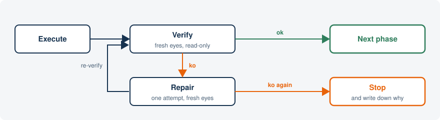
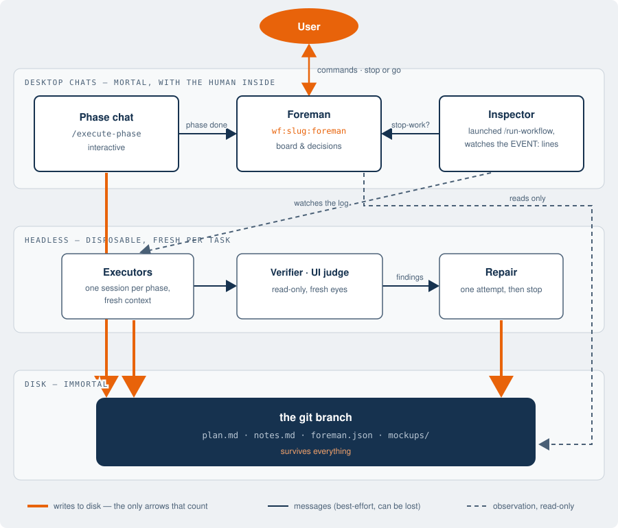

<picture>
  <source media="(prefers-color-scheme: dark)" srcset="docs/img/logo-on-dark.svg?v=2">
  
</picture>

# Working in phases with Claude Code

**Version 6.0.2** — see the [Changelog](#changelog). For people who already use Claude Code freestyle, with good results, and want to know what a method adds — no leap of faith required.

> **Rather try it than read about it?** [Workflow tutorial game](https://fporcari.github.io/workflow-tutorial-game/) — the method as an interactive tutorial, in the browser, nothing to install.

## Quickstart

```bash
> /write-workflow      # asks: interactive or autonomous? then branch + plan
> /execute-phase       # interactive: one phase per chat
> /run-workflow        # autonomous: the whole plan, unattended
> /finalize-workflow   # QA, whole-diff review, one clean commit
> /resume-workflow     # lost? this reads the branch and tells you where you are
```

Install in [Getting started](#getting-started); every command, marker and file in the [Cheatsheet](#cheatsheet).

---

## First, the problem

Freestyle works — genuinely — for any job that fits inside one chat. The trouble starts when the work is bigger than a session:

1. **Long chats rot.** The context fills up, decisions made at the start fall out the other end, Claude re-does analysis it already did, and quality degrades the further you go.
2. **A chat is not a medium.** `--resume` gives you the conversation back, not the state: it is on your machine, in your list, and to find out where you were you have to re-read it. Meanwhile the things that matter — where you are, what is missing, why you chose this way — cannot be read by another session, another agent, or a colleague. What lives only in a chat lives for one person, on one laptop.
3. **Unattended work burns tokens in the dark.** You leave Claude working alone, step out, and nobody notices it is circling the same error until you come back.
4. **"Done" is self-certification.** Claude says "done, everything works" — but it is Claude saying it. On interfaces it is worse: whether a page *looks right* is not something a test decides.

> **"Isn't this overkill?"**
> Fair objection. For the twenty-minute fix you are right: open a chat and go — this tool has nothing for you. It pays off when the work outlives one session, when you come back to it in pieces across different days, or when you want to let it run alone without surprises on the bill. Below that threshold: freestyle away.

> ### Every arrow into a chat can die. Every arrow into disk survives.
>
> The whole answer to the four walls rests on that sentence: chats are day labor, the project lives on git.

## The work splits into phases

*Answers wall 1: long chats rot.*

Instead of one endless chat, you first write a **plan** that splits the work into phases. A phase is a small piece with three things in writing: the goal, the files it may touch, and a "done" criterion *a machine* can check:

```markdown
- [ ] **Phase 3**: Token counter in the launcher
  - Details: add the cumulative per-run count
  - Files: lib/launcher.sh, tests/test_launcher.sh
  - Done: tests pass && the log reports the total
```

Then every phase runs in a **brand-new session** that reads the plan and starts with fresh context. No 400-message chats: the memory of the work lives in the plan, not in the conversation. Like a construction site — today's crew reads the drawings pinned in the site office, not the memories of yesterday's crew.

## Interactive or autonomous

*The choice underneath everything: how much leash?*

The plan is the same; what changes is **who verifies**:

- **Interactive** — one phase at a time; you look at the result and say go. Claude Code as you already use it, but with a map.
- **Autonomous** — you launch it and go grocery shopping. "Done" is not declared by whoever wrote the code: a separate checker says it (the loop below). You get a notification when it finishes or when it stops.

|  | Interactive | Autonomous |
|---|---|---|
| Who verifies | you, phase by phase | tests, lint, and an independent reviewer |
| When something fails | you discuss it in the chat | one fresh-eyes repair, then it stops |
| Interfaces | a mockup is approved before any code is written | runs straight through with no visual judgment: the eye check lands on the bill, for you, at the end |
| Login | always the human | always the human — fixed rule, no exceptions |

## The loop: never a hamster in a wheel

*Answers walls 3 and 4: who checks, and when to stop.*

In autonomous mode every phase goes through a fixed cycle. Verification is done by a session with **fresh eyes and read-only access**: it did not write the code, so it has no stake in defending it. And the attempts are **counted**: if the problem is still there after one repair, the run stops and writes down why — instead of grinding tokens all night.



## The close: finalize is a phase of its own

*And when the plan is done — who looks at the whole?*

While the robot runs, every check that only a human eye can do — "is the page what it should be?" — does not stop the train: it is **put on the bill**, in a `verify.md` file that accumulates phase by phase. When the plan is done, the first thing you do is the eye check against that list: like at a restaurant, the bill arrives once, at the till — not one course at a time. The bill comes as a **QA page** — a rendered checklist, one checkbox per check, each with the action to exercise and the result you should see — so you work through it at your own pace and tick as you go.

Then you run `/finalize-workflow` — and here is the point that is easy to miss: up to now **nobody has ever seen the work as a whole**. Every phase was born in a fresh session and was checked in isolation: that is the price of always-clean context. Finalize pays it in one pass, with a review of the entire diff that hunts precisely the problems *between* phases — one phase breaking another's assumption, the same helper written twice by sessions that never met, style drifting along the way.

**How deep that review goes is your call, not a fixed cost.** Finalize asks once — extended, light, or none — and recommends from what it knows: when a human eye lands on the result anyway (you vetted each phase as it ran, or the QA page exercises what was built), the light pass hunts only the between-phases residue at a fraction of the tokens; when nothing human ever looks at the work, the extended pass is the only eye it gets and earns its price. On large autonomous jobs a fourth option appears, the **panel**: four reviewers in parallel (correctness, cross-phase coherence, pattern conformance, test coverage), and every finding then faces three skeptics instructed to *refute* it — only what survives reaches you. And finalize **never touches the code**: it reports and delegates; the decisions stay yours.

Before closing, two more gestures: the **lessons of the run** are rescued (the traps discovered, the "why the first attempts missed") — because the workflow branch gets thrown away, and without this step the method never learns — and the whole job becomes **one clean commit**, with three exits to choose from: pull request, direct merge on the parent, or "just commit, I'll decide later".

## Git is the memory, not an archive

*Answers wall 2: where the memory lives, if a chat holds it for one person only.*

Every job is a **branch**, and the plan travels committed inside the branch: any session — or colleague — that opens the branch has everything, without asking anyone.

- **One phase = one clean commit**, saying what it did. The history reads like the plan.
- **Regressions have a culprit**: every phase declares the files it touches, so when something breaks, git says which phase broke it.
- **Half-done work is not lost**: work in progress leaves a committed footprint too, so the next session resumes from there instead of doing archaeology.

That is why no chat is worth going back to: close everything, come back in three days on another machine, and `/resume-workflow` reads the branch and picks up — no `--resume` to hunt for, no scrollback to re-read.

## Model and effort, per phase

*The part nobody does freestyle: how much brain per piece?*

Not every phase deserves the same brain — and big brains are expensive. At planning time each phase gets **the model and the effort level that fit it**: the routine phase runs on the light model, the delicate one on the heavy model. Freestyle, you pay for the top model even to rename a variable.

And there is the rule that inverts instinct: **a well-specified phase runs alone even on a mid model; a vague phase fails even on the best in the world.** When something goes wrong, the knob to turn is not "more power" — it is "better spec". That is why the method invests everything in the quality of the plan: that is where the yield is, and the bill.

## Compared to Spec Kit, OpenSpec, Task Master

Those tools attack the planning half of the problem: they structure *what to build* — constitutions and specs (Spec Kit), spec-change proposals (OpenSpec), task graphs from a PRD (Task Master) — and then hand the tasks back to your assistant to execute as usual. This plugin overlaps with them on planning and keeps going where they stop, because the four walls above are execution problems: disposable sessions with the committed plan as shared memory, "done" re-checked by an evaluator that did not write the code, bounded budgets with automatic repair and a stop-work channel for unattended runs, and one cross-phase review of the whole diff before a single clean commit lands. If you already keep specs in one of those formats, `/import-workflow` adapts an existing plan instead of starting over.

---

# Under the hood

*From here down, the details — for whoever wants them.*

## Who talks to whom

Three tiers: desktop chats at the top (with the human inside), disposable sessions in the middle, disk at the bottom. All the real work converges at the bottom.



Messages between chats are best-effort by design — any of them can be lost and the run still stands, because a chat that wants the truth re-reads `.phased/` from disk instead of trusting what it was told.

## The cast

| Role | Runs where | Writes what | Dies when |
|---|---|---|---|
| Foreman | desktop chat | nothing on the code: decisions only | replaceable — its identity lives in `foreman.json`, not in the chat |
| Inspector | desktop chat | inspection notes | with the chat that launched the run |
| Phase chat | desktop chat | code + the phase commit | when its phase closes |
| Executor | headless `claude -p` | code + the phase commit | every phase — born with fresh context |
| Verifier | headless | nothing: read-only, emits findings | after the verdict |
| UI judge | headless | nothing: compares screenshots to the approved mockup — interactive `ui` phases only | after the verdict |
| Repair | headless | the fix, one attempt | after the attempt |

## Succession

`foreman.json` says who commands: if the foreman chat dies, the first `/resume-workflow` takes command by reading the file. Succession never depends on the old chat answering — it works on the plan and the notes alone. The same holds one level down: a phase chat hands over through a `partial` commit, a `> WIP:` note and its rationale in `notes.md`, and the chat that picks the phase up asks the old one only for what the disk could not carry.

If a phase dies midway (a `[>]` marker left hanging), the committed evidence of the work in progress lets the next session resume from there: the phase is reopened, not the story reconstructed.

## Stop-work

The inspector has one power beyond reporting: when continuing looks like waste — a repair cascade, a tripped budget cap, phases closing suspiciously fast, an outcome that undermines a phase still to run — it sends the foreman one of the protocol's two questions: `stop-work?`

The foreman **does not decide alone**: it turns the question to you (*Stop workflow / Go on*). The agent is the smoke detector; the switch stays in your hand.

## Clarify

The protocol's other question belongs to interactive mode, and its decision policy is the mirror image. When a phase chat hits an ambiguity in the plan — what the objective means, what `Done:` covers — you are not the first responder: the foreman authored the plan and holds the reasons it is shaped that way, so the phase chat asks it first (`clarify?`). The foreman decides, writes the decision to disk (its notes, committed), and replies carrying the plan edit the decision implies; the phase chat shows you the decision and, on your ok, applies that edit and commits it — no other confirmation asked of anyone, anywhere. A foreman in doubt does not guess: it sends the question back down, rephrased, and the phase chat puts it to you.

Either way you stay in one chat: the foreman never speaks to you directly. And because the decision is committed before the reply travels, a lost message loses nothing: the phase chat re-reads the plan directory before bothering you, and only a silent disk means the question falls back to you exactly as it did before the protocol existed.

## The plan's markers

| Marker | Meaning |
|---|---|
| `[ ]` | to do — nobody has picked it up yet |
| `[>]` | in progress — set by the executor at start; hanging beyond ~2h, resume flags it as a suspect dead session. Also the state of a phase whose code is done and committed and which is waiting for *your* checks (`> Testing:`) — that one is not stale, it is waiting |
| `[x]` | closed and verified: the `Done:` criterion passed, the phase commit exists |
| `[!]` | failed with the bounded attempts exhausted — one automatic fresh-eyes repair, then it waits for you. A machine verdict only: a result *you* judge wrong never lands here, it becomes new phases |
| `[~]` | blocked on a red baseline no phase owns — the chain has no mandate over it, so it goes to the human |

Every transition leaves structured notes on the phase (`> Done:`, `> Files:`, `> Issue:`, `> Attempted:`, `> Repaired:`, `> Review:`, `> Verify:`, `> Testing:`) — the machine-readable evidence that makes fresh-eyes repair and the final review possible. The full vocabulary lives in [refs/common.md](plugins/wf/refs/common.md).

## Where the plan lives

```
.phased/                        # committed on the workflow branch, never reaches the parent
  roadmap.md                    # megaplans only — macro-phases still to detail
  active/<slug>/                # exactly one at a time
    plan.md                     # the work plan
    notes.md                    # per-phase rationale + run inspection notes
    verify.md                   # the bill: human checks deferred to the end
    foreman.json                # which chat commands this workflow
    mockups/phase-N.html        # ui phases — the approved visual contract
    log/phase-N.txt             # transcript of each autonomous sub-session
  done/<slug>/                  # archived by /finalize-workflow
```

## Commands

### Core workflow

| Command | When | What it does |
|---------|------|--------------|
| `/scope-workflow <what>` | the work is still vague | interrogates you one question at a time until every decision the plan needs is settled — facts looked up, never asked |
| `/write-workflow` | after discussing the work | asks the one automation question (interactive or autonomous?), opens the `wf/` branch, writes and commits the plan |
| `/import-workflow` | you already have a plan or a handoff | adapts it to the format, preserving phase states verbatim and reporting gaps instead of inventing them |
| `/execute-phase` | interactive execution | one phase per chat: one approval gate up front (with a rendered mockup on `ui` phases), then no interruptions |
| `/close-phase` | the phase's work is finished | naming review of the new methods (accept-all is one keypress), Done gate, `[x]` record, one phase commit — invoked by `/execute-phase`, by the model when the work is done, or manually on a `[>]` phase a dead session left complete |
| `/resume-workflow` | "where were we?" | read-only audit of plan vs git: drift, stale phases, next step — and the board strip, on interactive plans |
| `/finalize-workflow` | all phases done | QA page from `verify.md` (a checklist you tick as you exercise), naming review of what autonomous phases created, whole-diff review at the depth you choose, lessons, one clean commit — PR, merge, or leave it |
| `/pull-request` | delivering by PR | maintainer-grade review, then creates the PR |

### Autonomous execution

| Command | When | What it does |
|---------|------|--------------|
| `/run-workflow` | the whole plan, unattended | pre-flight review, then one fresh `/goal`-guarded session per phase; the launching chat stays on as the run's inspector |
| `/execute-phase-agent` | one phase, unattended | the same phase execution with nobody to ask: convergence loop, independent verification where it earns its keep, `Done:` gate |
| `/repair-phase` | a phase came back `[!]`, or you found a defect mid-phase | fresh-eyes repair in a chat of its own — asks you what is wrong, never repeats a listed attempt, and you decide when it is fixed. Closes an `[!]` phase; hands a `[>]` one back to the chat that owns it |
| `/repair-phase-agent` | the same, unattended | `[!]` only, no questions, the outcome is the run's exit condition |

### Auxiliary

| Command | When | What it does |
|---------|------|--------------|
| `/issue <number>` | starting from a GitHub issue | loads and analyzes it — analysis only, the plan comes from `/write-workflow` |

Every command declares its own `allowed-tools`, and the test suite fails if a skill instructs a command its allowlist does not permit.

## Getting started

Prerequisites:

- [Claude Code](https://claude.com/claude-code) **≥ 2.1.170** for autonomous runs — `/goal` guards the sub-sessions (2.1.139; older versions fall back to plain skill prompts at runtime) and the repair session runs on `fable` (2.1.170; on an older CLI the run still completes, falling back to `opus`, and a phase that pins `Model: fable` fails to launch). The interactive path needs no more than **≥ 2.1.139**.
- `bash` and `python3` on `PATH` — every skill resolves the active plan through `scripts/next-phase.py`, and the autonomous launchers are shell scripts. This holds for the interactive path too, not just for `/run-workflow`.
- `git` with a remote, `gh` authenticated.

macOS and Linux. Windows is not supported: the launchers need a bash shell, which Claude Code no longer requires there, and `python3` is not the interpreter's name on that platform. Under WSL it behaves like Linux.

The desktop app adds the live run monitor and notifications; the CLI works without them.

**Install from the marketplace (recommended):**

```bash
claude plugin marketplace add fporcari/claude-phased-workflow
claude plugin install wf@claude-phased-workflow
```

Note the reference: `wf@` is the plugin, `claude-phased-workflow` is the **marketplace name** declared in `marketplace.json` — not the GitHub slug.

**Upgrading from 5.x** — the plugin was renamed `phased-workflow` → `wf` in 6.0.0, so the old entry has to go or you keep two installs:

```bash
claude plugin uninstall phased-workflow@claude-phased-workflow
claude plugin install wf@claude-phased-workflow
```

Nothing else changes: `.phased/` plans, `wf/` branches and phase commits carry no plugin name. Typed commands become `/wf:<name>` — the bare `/<name>` form works as before.

**Update to a new release** — one command; it refreshes the marketplace from GitHub by itself, no separate `marketplace update` needed. Restart open sessions to load the new version:

```bash
claude plugin update wf@claude-phased-workflow
```

**Per-project** (in the project's `.claude/settings.json`):

```json
{
  "plugins": {
    "marketplaces": ["fporcari/claude-phased-workflow"],
    "installed": ["wf@claude-phased-workflow"]
  }
}
```

**From a clone** (for developing the workflow itself):

```bash
git clone https://github.com/fporcari/claude-phased-workflow.git
claude plugin marketplace add ./claude-phased-workflow
claude plugin install wf@claude-phased-workflow
```

Installing the plugin is the whole install — skills, launcher, phase selector, verifier subagent and shared refs all resolve through `${CLAUDE_PLUGIN_ROOT}`. **Never copy the skills into `~/.claude/commands/`**: a flat copy wins the bare `/<name>` over the plugin and keeps an old version running without you noticing. Migrating from ≤ 4.0.0? A one-time `install.sh` in the plugin cache moves the superseded flat copies aside — moving, never deleting.

First use:

```bash
claude
# discuss the work, then:
> /write-workflow      # it asks: interactive or autonomous?
# interactive: a new chat per phase        autonomous: one command
> /execute-phase                           > /run-workflow
# when every phase is done:
> /finalize-workflow
```

## Tests

```bash
bash tests/orchestration/run_tests.sh     # free: no sessions, no model
```

**210 assertions over 32 scenarios** (S1–S33, S16 retired). The launcher scenarios drive the shipped `/run-workflow` script against a mock `claude` binary — call shape, model/effort/cap selection, repair resuming or stopping the loop, red-baseline attribution, the no-progress guard. The rest guard invariants that live in prose, each proven by mutation: break the clause and the assert must fail. The suite runs under **both bash and zsh**, because the production shell is zsh and a bash-only harness cannot see zsh-specific breakage. The scenario-by-scenario catalog is in [docs/design-notes.md](docs/design-notes.md); CI ([.github/workflows/ci.yml](.github/workflows/ci.yml)) runs flake8, both suites and the plan validator on every push and PR.

There is also a benchmark harness (`tests/benchmark/bench.sh`) that runs real sessions on a fixture project and judges success externally — pytest, flake8 and plan state, never the session's self-report. [tests/benchmark/results/README.md](tests/benchmark/results/README.md) records what each archived run actually measured and which conclusions survive it — including the ones that did not.

## GenroPy worktree support

If you develop with [GenroPy](https://www.genropy.org/), the `genropy-worktree` plugin makes `gnr` CLI commands work from workflow worktrees — see [plugins/genropy-worktree/README.md](plugins/genropy-worktree/README.md).

## Cheatsheet

*Every command, marker and file — one screen.*

| You want to | Type | Where it belongs |
|---|---|---|
| turn a vague idea into settled decisions | `/scope-workflow <what>` | before the plan exists |
| turn the discussion into a plan on a branch | `/write-workflow` | it asks: interactive or autonomous? |
| bring in a plan you already have | `/import-workflow [path]` | instead of `/write-workflow` |
| start from a GitHub issue | `/issue <number>` | analysis only — no plan, no code |
| do the next phase, one phase per chat | `/execute-phase` | interactive |
| close a phase whose work is finished | `/close-phase` | interactive — usually called for you |
| run the whole plan unattended | `/run-workflow` | autonomous |
| run exactly one phase unattended | `/execute-phase-agent` | autonomous |
| retry a phase that came back `[!]` | `/repair-phase` | one attempt, fresh eyes — `-agent` for the unattended run |
| chase a defect without burning the phase chat | `/repair-phase` in a new chat | the phase chat stands down, the repair hands back |
| ask where the work stands | `/resume-workflow` | any time, any chat, read-only |
| close the job: QA page, whole-diff review, one commit | `/finalize-workflow` | when every phase is `[x]` |
| deliver by pull request | `/pull-request` | after finalize, if you chose to leave it |

**Plan markers** — `[ ]` to do · `[>]` in progress · `[x]` done and verified · `[!]` failed, waiting for you · `[~]` blocked on a red baseline nobody owns.

**On disk**, committed on the `wf/` branch, under `.phased/active/<slug>/` — `plan.md` the work · `notes.md` the why · `verify.md` the human bill · `foreman.json` who commands · `mockups/` the visual contract of `ui` phases · `log/` the sub-session transcripts.

**Who says "done"** — interactive: you do, phase by phase. Autonomous: tests, lint and a read-only verifier that did not write the code. Login is the human's in both, with no exception.

**Lost?** `/resume-workflow`. It needs the branch, nothing else — not the chat that started it, not the machine it ran on.

## Changelog

One note per release, in [docs/](docs/):

| Version | In one line |
|---|---|
| [6.6.0](docs/release-6.6.0.md) | repair splits in two: with you it asks what is wrong and hands the phase back, unattended it closes on its own — and a defect found mid-phase leaves the phase chat |
| [6.5.0](docs/release-6.5.0.md) | a phase that outgrew its chat closes on what it reached: the `Done:` is corrected to the truth and the foreman grows a phase for the remainder |
| [6.4.0](docs/release-6.4.0.md) | handing over a long phase is a move you can call, a tool you have not loaded is not a tool that is absent, and a phase chat does not supervise |
| [6.3.0](docs/release-6.3.0.md) | a rejected result travels up as its own line and re-plans the phases that have not run — no `[x]` and no report before you have answered |
| [6.2.1](docs/release-6.2.1.md) | rejecting a result at the test gate no longer marks the phase `[!]`: its tests are green, so what changes is the decomposition |
| [6.2.0](docs/release-6.2.0.md) | the board becomes a strip you read: the controls go back to the conversation, which now carries remarks upward on its own |
| [6.1.0](docs/release-6.1.0.md) | a phase with checks left to you does not close itself: work committed, phase open, `/close-phase` on your ok — and the foreman answers a phase report with the delta, not a redrawn board |
| [6.0.3](docs/release-6.0.3.md) | the chat titles itself — the foreman's rename was the last manual step — and the messaging channel is tried `list_sessions` first |
| [6.0.2](docs/release-6.0.2.md) | the clarify decision survives a dead reply: committed to notes first, the plan edit travels in the reply, the child applies it on acceptance |
| [6.0.1](docs/release-6.0.1.md) | field-tested `clarify?`: the foreman replies before touching the plan, and take-command advises the permissions an unattended reply needs |
| [6.0.0](docs/release-6.0.0.md) | the plugin is renamed `wf`: the command prefix stops swallowing the skill name — `/wf:execute-phase` |
| [5.18.0](docs/release-5.18.0.md) | `clarify?`: plan ambiguities in interactive phases go to the foreman first; the human confirms the decision in the child chat |
| [5.17.1](docs/release-5.17.1.md) | the foreman commands and does not execute: no skill sends the next phase back to the chat that holds the plan |
| [5.17.0](docs/release-5.17.0.md) | new methods are born marked, their names reviewed in one map — one keypress to accept all — and `/close-phase` closes the phase |
| [5.16.0](docs/release-5.16.0.md) | the QA pass becomes a tickable checklist page, and finalize's whole-diff review asks its depth — light where a human eye already landed |
| [5.15.0](docs/release-5.15.0.md) | the plugin stops choosing the conversation language: English canon for every shipped wording, the language follows the user |
| [5.14.0](docs/release-5.14.0.md) | closing reports get a shape — verdict plus one line per finding — a comprehension-probe gate, and a report page with detail behind a click |
| [5.13.0](docs/release-5.13.0.md) | workers read the whole plan as context, the inspector watches cross-phase coherence, and reports speak the decision-maker's language |
| [5.12.0](docs/release-5.12.0.md) | the `ui` tag: mockup gate at approval, browser pass with human login, and the ui-judge |
| [5.11.0](docs/release-5.11.0.md) | the run inspector: per-phase events relayed to the foreman, and the stop-work question |
| [5.10.1](docs/release-5.10.1.md) | the foreman field-tested: the title is the address, the user's rename is the one manual step |
| [5.10.0](docs/release-5.10.0.md) | the foreman: one chat commands the workflow, phase chats report to it over cross-session messaging |
| [5.9.0](docs/release-5.9.0.md) | a skill that waits says so: the gate line, one gate at finalize, no fake questions |
| [5.8.0](docs/release-5.8.0.md) | the resume path leaves evidence a fresh session can diff, and the version claim is checked |
| [5.7.1](docs/release-5.7.1.md) | `problema` is two things, and only one of them is repairable |
| [5.7.0](docs/release-5.7.0.md) | the board becomes a working view, shared by planning and supervision |
| [5.6.1](docs/release-5.6.1.md) | the board's controls become mandatory, and the chip opens in the plan's root |
| [5.6.0](docs/release-5.6.0.md) | `Run:` hint on interactive plans, and a board in `/resume-workflow` |
| [5.5.0](docs/release-5.5.0.md) | the rename reaches the guide, and busts the plugin cache |
| [5.4.0](docs/release-5.4.0.md) | invocation discipline, and `/scope-workflow` |
| [5.3.0](docs/release-5.3.0.md) | per-model prompt steering for autonomous sessions |
| [5.2.1](docs/release-5.2.1.md) | act on the adversarial review of 5.1.0–5.2.0 |
| [5.2.0](docs/release-5.2.0.md) | interactive mode as a first-class mode |
| [5.1.0](docs/release-5.1.0.md) | the unattended run |
| [5.0.0](docs/release-5.0.0.md) | command surface, plan location, workspace lifecycle (breaking) |
| [4.1.0](docs/release-4.1.0.md) | acting on the external review of 4.0.0 |

The deep rationale — why the commands are shaped the way they are, the design decisions and the trade-offs behind them — lives in [docs/design-notes.md](docs/design-notes.md) and [docs/loop-engineering.md](docs/loop-engineering.md). The Italian source of this README's structure is [docs/architettura-it.html](docs/architettura-it.html).

## License

MIT
