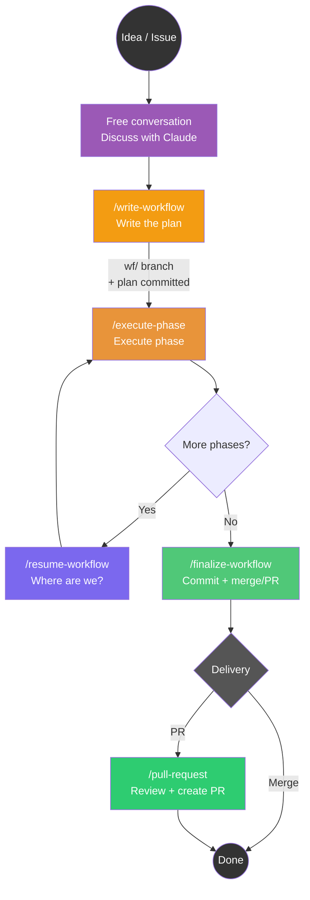
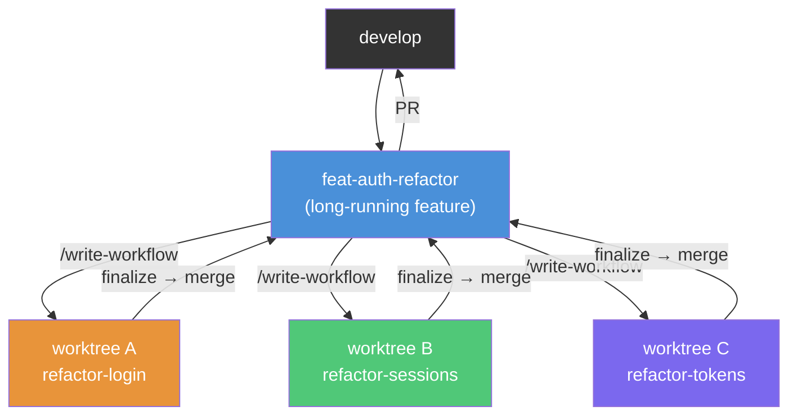

# Claude Code Phased Workflow

**Version 5.11.0** — see the [Changelog](#changelog). Requires the [Claude Code](https://claude.com/claude-code) desktop app for the full experience (the live Monitor and run notifications); the CLI works without them.

A slash command system for Claude Code that structures development work into planned phases, executable in independent sessions, with shared state on the file system.

It runs in two modes, and the choice is about **who the verifier is**:

- **Supervised** — `/execute-phase`, one phase per chat, you verify. For UI work, exploration, decisions that only emerge while doing.
- **Autonomous** — `/run-workflow` loops one fresh session per phase, each under a native `/goal` contract, with a convergence loop, an independent read-only reviewer, and one fresh-eyes repair attempt on failure. For phases whose feedback signal is machine-checkable: measurable `Done:`, runnable tests, decisions already made in the plan.

A vague phase fails autonomously on the best model in the world; a well-specified phase runs autonomously even on sonnet. See [docs/loop-engineering.md](docs/loop-engineering.md) for why the commands are shaped the way they are.

## The Pattern: Converse, Plan, Execute, Verify, Finalize



> **Note:** `/write-workflow` opens the workflow branch and commits the plan as its first commit — branch and plan only. Worktrees belong to execution: `/run-workflow` attaches or creates one when the run needs it, and `/finalize-workflow` removes it.

The autonomous path replaces the middle of that diagram with a loop that runs unattended:


---

## Why This Approach?

### The Problem: Context Window Limits

Claude Code operates within a finite context window. Long sessions lead to:

- Lost decisions from earlier in the conversation
- Repeated analysis of the same code
- Progressive quality degradation

### The Solution: File-Based State, Disposable Sessions

1. **Discuss freely** with Claude — no special format required
2. **Crystallize the plan** into `.phased/active/<slug>/plan.md` with `/write-workflow`
3. **Execute each phase in a dedicated chat** — fresh, full context every time
4. **Finalize** with a single clean commit, then PR or merge

The plan is the coordination point between sessions, and it is committed on the workflow branch — so the branch, not a scratch file, is what holds the run together.

---

## Commands

### Core workflow (works anywhere)

| Command | When to use | What it does |
|---------|------------|--------------|
| `/scope-workflow <what>` | The work is still vague | Interrogates you one question at a time until every decision the plan needs is settled — facts looked up, not asked; no branch, no file, no code |
| `/write-workflow` | After discussing the plan | Opens the workflow branch and writes the plan from the conversation — pattern references and pre-made decisions per phase |
| `/import-workflow` | You already have a plan or a handoff | Adapts an existing plan (including pre-4.0 `MEMORY.md`) into a workflow, preserving phase states and reporting the gaps |
| `/execute-phase` | Executing a phase | Runs the next phase from the plan: one approval gate up front, then no interruptions |
| `/resume-workflow` | Where are we? | Read-only audit of plan vs git state — drift, stale phases, next step; healthy plans just get the report |
| `/finalize-workflow` | All phases done | Whole-diff pre-commit review + single clean commit + offers PR or merge |
| `/pull-request` | Creating a PR | Rigorous code review + PR creation |

### Autonomous execution (self-correcting loops)

| Command | When to use | What it does |
|---------|------------|--------------|
| `/execute-phase-agent` | One phase, unattended | Like `/execute-phase` with no confirmations: convergence loop (3 attempts against tests + lint, no-progress detector), independent review, `Done:` gate |
| `/run-workflow` | The whole plan, unattended | Pre-flight review, then one fresh `/goal`-guarded session per phase; light mode for `Effort=low`; one repair attempt on failure before stopping. The launching chat is the run's inspector: it relays every event to the foreman and can raise the stop-work question |
| `/repair-phase` | A phase came back failed | Fresh-eyes repair: reads the `> Issue:` and `> Attempted:` notes, may not repeat a listed attempt, restarts from the diagnosis |

### Auxiliary

| Command | When to use | What it does |
|---------|------------|--------------|
| `/issue <number>` | Starting from a GitHub issue | Loads and analyzes it — analysis only, the plan comes from `/write-workflow` |

Every command declares its own `allowed-tools`, and the test suite fails if a skill instructs a command its allowlist does not permit — see [Tests](#tests).

---

## Typical Flow

### Simple (no worktree)

Work directly on your branch — ideal for a single task at a time.

```bash
claude
# Discuss the work freely with Claude...
# When the plan is clear:
> /write-workflow

# Execute phases (new chat for each — fresh context)
> /execute-phase    # Phase 1
> /execute-phase    # Phase 2

# Finalize
> /finalize-workflow
> /pull-request
```

### Isolated (with worktree)

Use when you need to **parallelize** multiple tasks on the same repo. Each worktree has its own branch, files, and plan. Worktrees are plain git — the tooling creates one on demand for autonomous runs; for interactive work you add it yourself:

```bash
claude
# 1. Discuss the work, then crystallize the plan
> /write-workflow          # opens wf/add-pdf-export, commits the plan

# 2. Give the branch its own checkout and work there
git switch main
git worktree add .claude/worktrees/add-pdf-export wf/add-pdf-export
cd .claude/worktrees/add-pdf-export && claude

# 3. Execute phases (new chat for each)
> /execute-phase

# 4. Finalize — it offers to remove the worktree when it is done
> /finalize-workflow
```

### Autonomous

Ask `/write-workflow` for an autonomous plan: it applies stricter rules — measurable `Done:` criteria (they become the loop's exit condition), every judgment call settled during planning, a pattern reference per phase.

```bash
claude
# Discuss the work, then:
> /write-workflow          # say you want an autonomous plan
> /run-workflow          # pre-flight review, you confirm, then it runs

# Come back later:
#   every phase [x]        -> /finalize-workflow
#   a phase left [!]       -> read its > Issue:/> Attempted: notes, then
#                             /repair-phase (a second repair is deliberate,
#                             not automatic)
#   a phase left [~]       -> a red baseline nobody owns: fix it, then relaunch
```

For plans beyond ~8-10 phases, or when a phase's shape depends on an earlier phase's *outcome*, `/write-workflow` splits the work into macro-phases: only the first is detailed, the rest stay as inert bullets in `.phased/roadmap.md`. Each macro gets its own `/run-workflow` + `/finalize-workflow`, and the next `/write-workflow` re-plans with hindsight. The macro loop is deliberately manual — its boundary is where human judgment pays most, before errors compound.

---

## How Each Command Works

### Free Conversation — Natural Planning

Start a session in the repo:
```bash
claude
```

Talk to Claude naturally: describe what you want, explore the code together, discuss approaches. No required format, no special commands — just a normal chat.

### `/scope-workflow` — Settle the Decisions First

`/write-workflow` settles decisions **by reading the conversation**. When the conversation was vague there is nothing to read, and the plan comes out with "decide later" phases — which that skill's own rules forbid. This is the command that makes the conversation not vague, and it produces understanding only: no branch, no plan file, no code.

Four rules carry it:

- **A fact is looked up, never asked.** What exists today, where it lives, who calls it, what the issue says — Grep, Read, `git log`, `gh issue view`. Asking you something the filesystem can answer spends your attention on its legwork. It reports the ground first, with paths, so a wrong premise is corrected before it costs a whole branch of questions.
- **One question per turn**, each carrying its recommended answer and the reason in one line — you often just confirm, which is the point. Asking several at once destroys the tree: you cannot branch on an answer you requested in parallel.
- **Every question fills a field of the plan** — `Mode:`, `Decisions:`, `Pattern:`, `Files:`, `Done:` — and it knows which one before asking. The mode fork goes first, because interactive and autonomous split the same work into different phases.
- **A decision belongs to you when either answer leads to materially different work.** Everything else it decides itself, says so, and moves on.

A question in the loop looks like this — recommendation first, and what the answer unlocks:

```
Il totale scontato: lo calcola il modello o la pagina?
  ▸ Nel modello (consigliato) — un punto solo, e l'export lo eredita
    Nella pagina — più rapido ora, due punti da tenere allineati poi
  (se rispondi "nel modello", la domanda dopo sull'export non serve più)
```

It ends by handing over in the shape `/write-workflow` reads, and waits for you to confirm it:

```
Mode: interactive — la resa a schermo si giudica guardandola

Deciso:
- sconto → calcolato nel modello (un punto solo, l'export lo eredita)   [Decisions:]
- pattern per la form → `packages/sales/webpages/order.py:orderForm`    [Pattern:]
- fase 2 è finita quando il test crea una riga dalla form e la rilegge  [Done:]

Rinviato:
- allineamento colonne nel grid → Verify: deferred: needs Phase 3

Fatti su cui poggia:
- lo sconto oggi vive in due punti (packages/sales/webpages/order.py, .../export.py)
```

Then: *"Lancia `/write-workflow` in questa chat: legge le decisioni da qui."* A plan that already exists stops it — scoping is for work that has none.

### `/write-workflow` — Crystallize the Plan

When the discussion is mature, run this command. Claude:

1. Synthesizes the conversation into **objective + concrete phases**
2. **Asks the automation fork** — one explicit question, *before* the plan is written: autonomous (`/run-workflow` runs it unattended) or interactive (one chat per phase with `/execute-phase`). It recommends one from the work just discussed (UI work → interactive; heavy refactor, project startup, mechanical migration → autonomous) and the answer selects the plan format and its `Mode:` header. Asking first is deliberate — an interactive plan cannot be rewritten into an autonomous one after the fact
3. Presents the plan for approval
4. Opens `wf/<slug>`, writes the plan with phases, involved files and execution config, and commits it
5. On an interactive plan, closes with **the board** — the same widget `/resume-workflow` draws, specified once in `refs/board.md`. Here every phase starts on `da fare` and there are no notes or export (nothing has run yet); Phase 1, as the first unfinished phase, is the one carrying `copia comando`. Only after the commit: a board offering a command for a branch that does not exist yet would be a trap

**Output:** a `.phased/active/<slug>/plan.md` file:

```markdown
# Context: feat-add-pdf-export
Parent: develop | Issue: #42

## Objective
Add PDF export capability for invoices...

## Work Plan
- [ ] **Phase 1**: Create PDF generator service
  - Details: ...
  - Files: src/services/pdf.py
- [ ] **Phase 2**: Add export endpoint
  - Details: ...
  - Files: src/api/invoices.py

## Suggested execution config
| Phase | Effort | Model |
|-------|--------|-------|
| Phase 1 | high | opus |
| Phase 2 | medium | sonnet |
```

The `Parent:` field is critical — it tells `/finalize-workflow` where to merge or create a PR.

### `/execute-phase` — Execute One Phase

Runs **one phase** per chat session.

This is the whole of interactive mode, not a lesser `/run-workflow`: here somebody can answer, so a doubt that needs a **decision** is asked live in the chat and execution resumes with the answer. Being asked to *try something trivial* mid-phase is not a question — it is a phase that was cut too small, and the cure is sizing.

Key behaviors:
- **One phase per chat** — always-fresh context
- **One commit per phase** — `wf(phase N): <title>` on the workflow branch (a WIP safety commit if context runs low); `/finalize-workflow` squashes them into one clean commit on the parent
- **Bigger phases** — an interactive phase ends where *something a human can look at exists*, so it cannot close on half a button
- **Per-phase `Run: <model> / <effort>` hint** — `opus` floor and default, never `sonnet` (the standing rule for UI and declarative work), `fable` where inventive work survives the gate; the effort scales how wide the phase looks before it asks. Advice, not enforcement: both are chosen when you open the chat, which is why `/write-workflow` and `/resume-workflow` quote it beforehand
- **Two verification fields** — `Done:` stays machine-re-runnable; `Verify:` carries the human steps, each with a *when* (`now`, or `deferred: needs Phase M`). What a browser agent can assert goes to the `ui-test` skill, never onto the human's list (`ui-test` ships separately — when it is not installed those checks fall to the human as `Verify: now` steps, declared, never dropped); deferred steps accumulate in `verify.md` and finalize presents them as one QA pass
- **Records modified files** in the `> Files:` line — source of truth for finalize
- **Reports to the foreman** — each workflow has one commanding chat (the *foreman*, recorded in `foreman.json` next to the plan; `/write-workflow`, `/import-workflow` and `/resume-workflow` take command, `/resume-workflow` can depose a stale one). Its address is the chat's **title** (`wf:<slug>:foreman` — the skills suggest it, renaming the chat is the user's one manual step): phase chats look the title up in the session list and message it the outcome — done, failed, blocked, plan changed — via the desktop session tools (in the CLI, cross-session messaging needs ≥ 2.1.224), best-effort by design: no foreman, no messaging tool, unclaimed title, dead session → silent skip, never a failed phase

### `/execute-phase-agent`, `/run-workflow`, `/repair-phase` — Unattended Execution

`/execute-phase-agent` is `/execute-phase` with the confirmations removed and the verification loops turned up:

1. **Baseline first.** Tests and linter run *before* the first edit. A phase that inherits someone else's breakage would otherwise attribute it to itself and spend its whole fix budget — plus a repair session — on a bug it did not cause.
2. **Convergence loop.** Tests and lint, fix, repeat — **max 3 attempts**, with an early stop when the same failure signature (same failing test, same exception) appears twice. Iterating blindly against the same error is how naive loops burn budget.
3. **Independent verification, where it earns its keep.** Not every phase: a read-only `phase-verifier` subagent runs on a `sonnet` phase, a `new-pattern` phase, or a repair — see [why below](#3-model-flexibility). In its own context window it gets the `Done:` criterion and the pattern reference; mechanical findings are fixed in-loop, judgment findings become `> Review:` notes for the human at finalize.
4. **`Done:` gate.** Every criterion from the plan is re-run literally. "Tests pass" is weaker than the plan's own `Done:`, and it is the `Done:` that closes the phase.

`/run-workflow` is the loop around it — a bash script, so it consumes no model itself:

- **The `/goal` guard** (Claude Code ≥ 2.1.139). Each phase and repair session is launched as `claude -p "/goal <contract>"`. The native goal loop adds an independent per-turn evaluator: a fresh, lighter model reads the transcript and decides whether the exit is genuine, so a premature "I'm done" gets sent back to work. A 25-turn clause bounds the loop. Older CLIs are detected at runtime and fall back to the plain skill prompt — everything still works, without the evaluator.
- **Light mode** for `Effort=low` phases: a slim `/goal` contract (~450 chars against the ~9.5KB skill body) carrying every chain invariant itself, per-phase commit included. Measured on the seeded toy fixture (n=3): ~37% cheaper and ~60% of the wall time — but that figure is the `slim` hardcoded control, not the light mode that ships, whose "same external outcomes" was never benchmarked against the current contract. [tests/benchmark/results/README.md](tests/benchmark/results/README.md) records what each run actually measured.
- **Repair is automatic, once.** A phase that exits `[!]` gets one fresh-eyes repair session (fable, opus fallback) launched by the loop; the run continues only if the repair turns the phase `[x]`. The `> Repair attempted:` note makes it idempotent — relaunching does not spend a second repair on the same phase. Delete that note to grant another round after intervening by hand.
- **Red-baseline attribution.** When the baseline check finds tests or lint already red, the failure is matched against the `> Files:` notes of completed phases. *Case A* — a `[x]` phase owns those files: it regressed and was closed wrongly, so it is **reopened `[x] → [!]`** and the ordinary repair path handles it; the run continues. *Case B* — nobody owns it: it pre-dates the run, and the pending phase goes `[~]` for the human. Ambiguity resolves to Case B, because a wrong reopen spends a phase's only repair on the wrong bug.
- **Bounded everywhere.** 3 fix attempts per phase, 1 repair per phase, 25 turns per contract, a notional dollar cap per session (doubled for fable, 250 for `xhigh`), and a no-progress guard that stops a run that is not moving.
- **Reportable while it runs.** The run stays attached to the launching session — leave the app open and it survives you stepping out. The launcher emits stable `EVENT:` lines, watched by a Monitor, and a proactive notification fires on the first `[!]` and once at the end, without waiting for the whole run — so the "I have to do the shopping" run tells you when it stops or finishes. Where those notifications land is your own notification setup, not this chain's business. Without Monitor/PushNotification it degrades cleanly: the script runs in the foreground and reports once at the end.

Model tiers are guidance, not constraint: strong models go where judgment happens, the medium tier executes with an automatic verifier behind it. The `phase-verifier` is pinned to opus rather than inherited — on a sonnet phase an inherited verifier is as weak as the executor it is meant to check. Full map in [docs/loop-engineering.md](docs/loop-engineering.md).

### `/resume-workflow` — Supervision & Resume

Read-only analysis of the plan vs actual code state: exact per-phase attribution from the phase commits, drift detection (files a commit touched but the plan does not list, uncommitted leftovers), stale `[>]` phases, oversized phases with a proposed re-phasing. Does not touch source code; the only file it may edit — on approval — is the plan, each edit with its own `wf:` commit. A healthy plan early-exits with the state report: "just tell me where we are" is a valid reason to run it.

**The board — interactive plans only.** On a `Mode: autonomous` plan the report stays text: there the next step is `/run-workflow`, one launcher that owns every remaining phase, and a per-phase button would invite the hand-driving that mode exists to remove. Where the `visualize` MCP server is present and the plan is interactive, the state of the plan and the next step render as an inline board — a header with the phase count, the branch and the mode, then one card per phase with its state, its `Run:` hint and its files — while coverage, drift and oversizing stay prose, because a grid shows a position well and argues a finding badly. **The grid plus its controls is the board; a grid without them is the old text report set in a table**, so the layout is fixed rather than left to the renderer: refresh in the header, and in the eligible phase's card `esegui qui`, `copia comando` and the launch command itself in full.

**No button runs a phase, and there is no refresh.** A widget's only channel is `sendPrompt`, which writes into the chat you are in — so a run button would execute the phase in the supervision chat, and a refresh could only re-run the whole skill and print a second report below, a recomputation dressed as a redraw. What the card carries instead is the command in full — on every unfinished phase, so you can read what is coming — with `copia comando` gated to the phase whose turn it actually is. Not because copying early could start something out of order (it cannot: `next-phase.py` picks the phase, and the argument is only a chat-title label) but because it would produce a chat *titled* `Phase 4` that runs Phase 2, and that title is what you will search for later.

**One state per phase, seeded from the plan, then yours.** Every card has a single `da fare` / `in esecuzione` / `fatta` / `problema` select, and the skill sets them all from the plan when it draws the board; from there you move them as the phases go, without waiting for a report to agree. `fatta` is offered only when every earlier phase is already `fatta` — the chain's ordering rule enforced where you click, not explained afterwards. The plan in the repository stays the only thing that is *true* (a widget cannot write to `plan.md`), but the board does not argue about it: it is re-seeded on every run, so a wrong marker survives until the next report.

**Notes and export.** Each card has an `annotazioni e problemi` textarea for what a phase's own chat surfaced, and the board's foot has `esporta prompt correzioni`, which copies one prompt built from the cards that have notes. The prompt forks on the case, which is the part that matters: for each annotated phase, decide whether it is a **puntual fix** or a **problem of design** — and in the second case propose the *new phases* that solve it, in the plan's own format, to be appended by `/resume-workflow`. Most of what a human notices in interactive mode is not a bug in a phase but a phase cut in the wrong place, and a prompt that only asks for a fix gets a patch where the plan needed another phase. That export is also the only way those notes leave the widget: they live in that message and die with it.

**`problema` means two things, and only one is repairable.** A phase the plan marks `[!]` failed its own `Done:`, and `/repair-phase` exists for exactly that. A phase that *passed* and that you judge wrong is not repairable — `/repair-phase` takes the first `[!]`, finds none, and says so; its job is to make a `Done:` green again, not to reopen a decomposition. So that card offers no command, and the plan grows instead: `/resume-workflow` appends new phases **in the tail, never in the middle**, because phase numbers are contiguous and an insertion would renumber phases whose commits already name the old numbers. A closed phase is never reopened — what it lacks becomes new work with its own phase and its own commit.

A `spawn_task` chip was tried in 5.6.0 and removed: it does open a session of its own, but its own UI decides how, including forking a new worktree for a plan that already has one, with no parameter to prevent it. No server → the plain text report, with the launch command spelled out.

**Adding phases for work that surfaced.** The plan can grow here, on approval and with its own `wf:` commit: new phases appended in the tail, written to the same bar `/write-workflow` applies (`Files:`, `Details:`, a re-runnable `Done:`, a `Pattern:` where the code is non-trivial, a `Run:` line). This is the answer to "this phase passed and is still wrong", and it never reopens the closed phase.

**Actualising an older plan.** A plan written before a format existed runs on invisible defaults, so this command offers to write them down on pending phases: the `Mode:` header when absent, the per-phase `Run:` line on an interactive plan. Defaults only — a missing `Done:` or `Pattern:` is a question its author never settled, and it gets reported, never invented (the rule `/import-workflow` already applies to gaps).

### `/finalize-workflow` — Finalize

When all phases are complete:

1. Verifies all phases are `[x]` and presents the QA pass — the `> Verify:` notes plus everything in `verify.md`, grouped by phase, deferred checks whose phase has landed now due
2. Reviews the whole workflow diff (`BASE..HEAD`) — in-session; or, when the plan lives in its own worktree, via a read-only `finalize-workflow-agent` sub-session launched at the plan's root by `agent-session.sh`. Findings are reported, never auto-fixed
3. Captures durable lessons, then archives the plan under `.phased/done/`
4. Consolidates the per-phase commits into a single clean commit
5. **Offers three options:**
   - **Pull request** — push and create PR toward the parent branch
   - **Merge on parent** — direct merge on the parent branch, then optionally remove the worktree
   - **Just commit** — leave as-is

The merge option is designed for the **long feature with parallel sub-tasks** pattern.

**After finalizing:** it offers to remove the worktree and the workflow branch. Decline and they stay on disk — `git worktree list` shows them, `git worktree remove <path>` clears them.

### `/pull-request` — Code Review + PR

Acts as a meticulous maintainer: checks issue coherence, code quality, comments in English, security. Blocks the PR with a detailed report if problems are found.

---

## Parallel Sub-Tasks

The most powerful pattern: a large feature that requires parallel work streams.



Each worktree:
1. Has its own isolated plan under `.phased/`
2. Has its own VS Code window (different title bar color)
3. Can be worked on independently
4. Merges back to the parent feature branch when done

Conflicts between sub-tasks emerge at merge time — exactly like in a human team, but with full visibility.

---

## Key Design Decisions

### Why worktrees?

Git worktrees create isolated working directories on separate branches. Each worktree has its own file tree, so parallel workflows don't interfere. `git add -A` in a worktree is safe — everything there belongs to that workflow.

### Why one commit per phase, then a squash?

Both paths commit once per phase — `wf(phase N): <title>` on the throwaway workflow branch — because the mechanics live once in `refs/phase-execution.md` and apply to `/execute-phase` and `/execute-phase-agent` alike. The per-phase commit is load-bearing: repair needs the failing code in history, and red-baseline attribution matches a failure against the `> Files:` of *committed* phases. `/finalize-workflow` then squashes those per-phase commits into one clean commit on the parent — so the parent branch still receives exactly one commit, with a proper message, either way.

(Before 5.0.0 the interactive path did not commit — the claim survived in older docs longer than in the code.)

### Why a separate `/write-workflow` command?

Planning is a natural conversation. Forcing it into a structured command felt rigid. Now you just talk to Claude, then `/write-workflow` captures the result. The plan comes from the discussion, not from a template.

### Why merge instead of cherry-pick?

When finalizing a sub-task worktree, merging the feature branch into the parent is cleaner than cherry-picking. It preserves history, avoids duplicate commits, and makes the merge visible in `git log`.

---

## Plan Format

The plan lives in `.phased/`, at the repository root, and is committed on the workflow branch:

```
.phased/
  roadmap.md                  # megaplans only — spans macro-phases
  active/<slug>/              # exactly one at a time
    plan.md                   # the work plan
    notes.md                  # free-form annotations
    log/phase-N.txt           # stdout of each /run-workflow sub-session
  done/<slug>/                # moved here by /finalize-workflow
```

One branch, one plan: resolution is `.phased/active/*/plan.md` and needs no discovery. `.phased/` never reaches the parent branch — the squash at finalize drops it, so the parent only ever receives clean code commits.

```markdown
# Context: <branch-name>
Parent: <parent-branch> | Issue: #<number>

## Objective
[2-3 sentences describing the goal]

## Work Plan
- [ ] **Phase 1**: <title>
  - Run: opus / medium          # interactive plans only — a hint, not a constraint
  - Pattern reference: <existing file:symbol to copy-adapt>
  - Decisions: <the calls settled during planning>
  - Details: <what to do>
  - Files: <involved files>
  - Done: <re-runnable checks — this is the loop's exit condition>
- [x] **Phase 2**: <title>
  > Done: what was accomplished, and how it was demonstrated
  > Files: path/to/file1.py, path/to/file2.py

## Notes
[Constraints, dependencies, attention points]

## Suggested execution config
| Phase | Effort | Model |
|-------|--------|-------|
| Phase 1 | medium | sonnet |
```

The automation fork writes an explicit `Mode:` header: `Mode: autonomous` on autonomous plans, `Mode: interactive` on interactive ones. A plan with **no** header stays legal and reads as interactive, so pre-5.1.0 plans keep working; the validator rejects any other value by name, and warns if an interactive plan still carries an execution-config table nothing will read. The two modes carry the model/effort choice differently: the table on autonomous plans, a per-phase `Run:` line on interactive ones (see [Model Flexibility](#3-model-flexibility)) — and `Run:` is a plain sub-bullet, so the validator neither requires nor rejects it. Ambitious autonomous plans also add a `## Roadmap` section whose bullets are inert — the launcher never executes them, it only reminds you they are pending.

### Phase States

- `[ ]` — to do
- `[x]` — done: `Done:` criterion demonstrated and externally green (must have a `> Files:` line)
- `[!]` — failed with the bounded fix attempts exhausted — `/repair-phase` handles it, once
- `[~]` — blocked on a red baseline no completed phase owns: the chain has no mandate over it, so it goes to the human
- `[>]` — in progress / resumable, reported as a resume candidate when no pending phase is eligible

### Note Fields

Every state transition leaves machine-readable evidence — this is what makes fresh-eyes repair and the knowledge harvest at finalize possible.

| Field | Meaning |
|-------|---------|
| `> Done:` | what was accomplished and how it was demonstrated |
| `> Files:` | files touched — the basis for attributing a later regression |
| `> Issue:` | why the phase failed |
| `> Attempted:` | attempts already made; a repair may not repeat one |
| `> Repaired:` | root cause, plus *why the earlier attempts missed it* |
| `> Review:` | judgment-level finding from the independent verification, for finalize |
| `> Blocked:` | the failure signature behind a `[~]` |
| `> Verify:` | one manual check left to the human, with its *when* (`now` / `deferred: needs Phase M`) — deferred ones accumulate in `verify.md`, all collected by finalize |
| `> Verified:` | optional record of the verification evidence a phase ran |

---

## Strengths

### 1. Always-Fresh Context
Each phase starts with a new chat. No degradation, no compaction, no "forgot what it was doing." The plan on file is the durable memory.

### 2. Git Checkpoints
Each finalized workflow = a clean commit. You can `git log` to reconstruct what happened, rollback, or resume from any point.

### 3. Model Flexibility
On an **autonomous** plan the `Suggested execution config` table sets model and effort per phase, decided by the pre-flight review rather than by a blanket rule:
- **opus** is the default and the answer whenever in doubt — and the **floor for anything touching UI or declarative code**, where the output is poorly testable and the loops can't catch much
- **sonnet** is the rare exception: mechanical work only — renames, extractions, moves — or an implementation that merely follows a cited pattern with a test-enforced `Done:`. Marking a phase `sonnet` is a commitment about the *plan*, not the model: whatever the skill no longer spells out, that phase must. If you can't write it that way, leave it opus
- **fable** for genuinely hard phases, and for repair — by definition the phase's own model already failed once, and nobody is watching

The stronger the verification loops, the cheaper the executor can be. The economics still bite, though: a sonnet phase that fails costs a fable repair, so sonnet pays only where first-pass success is likely.

Effort follows the same logic, with a twist specific to this chain. Anthropic's guidance is to stop reaching for `xhigh` reflexively and sweep downward, because `low` and `medium` punch well above their weight on current models — and here that applies harder than usual: a phase that passed the pre-flight is *well-specified by construction*, so high effort gets spent re-exploring and re-verifying decisions the plan already settled. Start low, climb only where real design judgment survives inside the phase, and treat `max` as practically never (it overthinks). Effort levels copied from an older plan rarely transfer.

On an **interactive** plan the same choice is a per-phase `Run: <model> / <effort>` line in the plan body — advice, not enforcement, since you pick both when you open the chat. Two values only: `opus`, the floor and the default; `fable` where inventive work survives *past* the approval gate. `sonnet` never — a phase mechanical enough for it belongs on the autonomous side of the fork. Fable's usual case is also halved here: it earns its premium where nobody is watching, and interactive work is watched by construction, so "the user will say whether it looks right" is an `opus` phase. Because the choice happens before any skill reads the plan, `/write-workflow` and `/resume-workflow` both quote the hint *before* the chat is opened, and `/execute-phase` scales how wide it explores to the effort it finds.

The same reasoning removed a step: `/execute-phase-agent` no longer sends every phase to an independent verifier. Current models verify their own work as they go, and telling them to verify again produces re-litigation rather than findings. The verifier now runs only where it earns its keep — a `sonnet` phase, a `new-pattern` phase, or a repair, where the code already failed once. The `Done:` gate still runs on every phase: that is a contract check against a criterion the executor did not write, which is a different thing from re-reading your own work.

### 4. The Human Moves to the Edges
Autonomous does not mean unsupervised — it means the supervision is concentrated where it pays:
- Plan approval (`/write-workflow`) — the plan is the loop's contract
- Pre-flight confirmation (`/run-workflow`) — before any session starts
- The macro-phase boundary on ambitious plans
- `/finalize-workflow`, where the whole-diff review happens, and any phase left `[!]` or `[~]`

Inside those edges the machine self-corrects. Nothing reaches the parent branch without you: on the interactive path `/finalize-workflow` is the only command that commits, and on the autonomous path the per-phase `wf(phase N)` commits land only on the throwaway workflow branch, which `/finalize-workflow` squashes into one clean commit you approve.

### 5. Parallel Workflows
Two approaches:
- **With worktrees** (recommended for parallelization): one plain-git worktree per task — `/run-workflow` creates it on demand for autonomous runs, or you add it yourself for interactive work (see [Typical Flow](#isolated-with-worktree)). Each gets its own branch, plan, and window.
- **Without worktrees**: one plan per branch — switch branches to switch workflow. `next-phase.py --plans` lists every workflow reachable from the repo, including branches with no checkout.

### 6. Full Traceability
Everything is traceable: plan in a versionable file, single clean commit per workflow, structured PR template, `/resume-workflow` reconstructs state at any time.

---

## Getting Started

### Prerequisites
- [Claude Code](https://claude.com/claude-code) installed — **≥ 2.1.139** for the `/goal` guard and light mode on autonomous sessions (older versions are detected at runtime and fall back to plain skill prompts)
- Git repository with remote configured
- GitHub CLI (`gh`) installed and authenticated

### Installation

**Option A — Install from marketplace (recommended):**

Add the marketplace and install the plugin directly from Claude Code:
```bash
claude plugin marketplace add fporcari/claude-phased-workflow
claude plugin install phased-workflow@claude-phased-workflow
```

Note the reference: `phased-workflow@` is the plugin, `claude-phased-workflow` is the **marketplace name** declared in `marketplace.json` — not the GitHub slug you passed to `marketplace add`.

Or from inside a Claude Code session:
```
/plugin marketplace add fporcari/claude-phased-workflow
/plugin install phased-workflow
```

**Option B — Install for a specific project:**

Add to your project's `.claude/settings.json`:
```json
{
  "plugins": {
    "marketplaces": ["fporcari/claude-phased-workflow"],
    "installed": ["phased-workflow@claude-phased-workflow"]
  }
}
```

**Option C — From a clone:**
```bash
git clone https://github.com/fporcari/claude-phased-workflow.git
claude plugin marketplace add ./claude-phased-workflow
claude plugin install phased-workflow@claude-phased-workflow
```

Installing the plugin is the whole install: the skills, the launcher, the phase selector, the reviewer subagent and the shared refs all ship inside the plugin and resolve themselves through `${CLAUDE_PLUGIN_ROOT}`. There is nothing to copy into `~/.claude` and no `install.sh` step to run.

> **Do not copy the skills into `~/.claude/commands/`.** That was the pre-3.0 install and it is now actively harmful: personal commands are flat and unnamespaced, so they collide with your other skills — and worse, a stale `~/.claude/commands/write-workflow.md` wins the bare `/write-workflow` over the plugin's copy, so you keep running an old version without noticing. Installed as a plugin, the skills are namespaced `/phased-workflow:<name>` and *cannot* conflict with any other level; the bare `/<name>` also works whenever nothing else claims it.
>
> Coming from an older install? `install.sh` is no longer part of the install — as of 4.1.0 it is a one-time **migration** for machines that ran **4.0.0 or earlier**. It moves aside (moving, never deleting) two kinds of superseded copies: the pre-3.0 flat commands under `~/.claude/commands/` → `~/.claude/phased-workflow-superseded-commands/`, and the 4.0.0 support files that used to be copied under `~/.claude/` (`scripts/next-phase.py`, `scripts/run-all-phases.sh`, `agents/phase-verifier.md`, and the two refs) → `~/.claude/phased-workflow-superseded-support/`. The unnamespaced `agents/phase-verifier.md` is the one that matters: left in place it wins over the plugin's own copy and keeps a stale reviewer running. Run it only if you are migrating; on a fresh install it has nothing to do.
>
> ```bash
> bash ~/.claude/plugins/cache/claude-phased-workflow/phased-workflow/*/install.sh   # only when migrating from ≤ 4.0.0
> ```

### First Use

```bash
claude
# Discuss your task with Claude, then:
> /write-workflow
# New chat for each phase:
> /execute-phase
# When all phases are done:
> /finalize-workflow
```

---

## FAQ

**Q: Can I use `/execute-phase` without `/write-workflow`?**
No. The command looks for an active plan under `.phased/active/` with phases to execute.

**Q: What if the session gets too long?**
`/execute-phase` monitors context proactively. It proposes a WIP safety commit and suggests a new chat.

**Q: Can I skip or reorder phases?**
Yes. The plan is Markdown — edit it. `/resume-workflow` verifies consistency.

**Q: Can I plan from any branch?**
Yes. From a base branch `/write-workflow` opens `wf/<slug>`. From a feature branch it adopts the one you are on by default, and the commits already there stay outside the workflow — the run's base is the plan commit, not the branch point.

**Q: Is VS Code required?**
No. The worktree is created regardless. Use any editor.

**Q: Do I have to use a worktree?**
No. It is offered only for autonomous plans, where the run occupies a checkout for a long time. Interactive plans stay on the branch in your current session.

**Q: I have plans from 3.x under `.claude/MEMORY.md`. What now?**
Run `/import-workflow`. It maps the old plan onto the new layout, preserving phase states and notes, and reports which phases fall short of the autonomous-ready bar instead of quietly filling the gaps. A plan with phases already `[x]` is imported in place, on the branch you are on, with no history rewritten.

**Q: Does the repair run by itself, or do I launch it?**
By itself, inside `/run-workflow`: a phase that exits `[!]` gets one repair session automatically, and the loop continues if it succeeds. You launch `/repair-phase` by hand only when the run already stopped (the automatic repair failed), when you are using `/execute-phase-agent` on its own without the launcher, or when you want a different model or effort than the launcher would pick.

**Q: Which phases can actually run unattended?**
The ones whose feedback signal is machine-checkable: a `Done:` you could re-run yourself, tests that exist, decisions already settled in the plan, and a pattern reference to copy-adapt. Everything verified by eye — UI, visual output, exploratory work — belongs to `/execute-phase`. The leash reflects the nature of the phase, not the quality of the model.

**Q: Can I walk away during a run?**
Yes — that is the point of `/run-workflow`. The run stays attached to the launching session, so leave the app open (the loop lives in its process tree; it survives you leaving the house, not the Mac shutting down). It notifies you proactively on the first `[!]` and once at the end; where that notification lands depends on how you have set notifications up. There is no detached mode on purpose: a detached run would have no live session to notify from.

**Q: Can it commit or push without me?**
Nothing reaches the parent branch without you. Both paths commit once per phase — `wf(phase N): <title>` — but only on the throwaway workflow branch, which `/finalize-workflow` squashes into the single clean commit you approve, and it asks first. Nothing pushes without you.

**Q: How do I clean up old worktrees?**
Plain git: `git worktree list` shows them all, `git worktree remove <path>` removes one, `git worktree prune` clears entries whose directory is already gone. `/finalize-workflow` offers to do it for the workflow it just closed.

---

## Tests

```bash
bash tests/orchestration/run_tests.sh     # free: no sessions, no model
```

**187 assertions over 29 scenarios** — S1 through S30, with S16 retired along with the KB mirror and its number left vacant. S1–S13 run the shipped `/run-workflow` bash script against a mock `claude` binary: `/goal` call shape, model/effort/cap selection, repair succeeding and resuming the loop, repair failing and stopping it, the idempotent repair marker, relaunch on a `[!]` *without* that marker, attribution Case A (a reopened phase drops the done-count without tripping the progress guard) and Case B (`[~]` stops the run), fable→opus fallback on a session crash, the no-progress guard, the inert `## Roadmap`, and the pre-2.1.139 prompt fallback. S19 checks that `next-phase.py --validate` gates the launcher before any session starts — and that warning lines are printed, not computed and discarded; S20 checks that every silent fallback (unknown model, unknown effort, missing selector) announces itself with a `NOTE:`. Two scenarios build real git repos instead of driving the mock: S17 (`/import-workflow`'s classification and its mid-run git sequence) and S22 (the `--plans` location service: root plan, worktree plan, orphan-branch plan read without checkout). S18 is a hybrid: it proves live that prose bullets in a `## Notes` section stay inert, and statically that every phase-state match is single-source.

The rest guard invariants that live in prose, each proven by mutation — break the clause and the assert must fail: S21 (skills and refs address the plugin, never `~/.claude`), S23 (`-agent` skills are thin variants citing their base, not second copies), S24 (the automation fork is real, not decorative), S25 (the `EVENT` contract — the stable lines a parent `Monitor` watches, emitted exactly once, including on an all-`[x]` early exit and on a validation failure), S26 (every `claude -p` sub-session prompt carries a `plugin:` namespace), S27 (the `Done:`/`Verify:` contract lives once in `common.md` and is cited, not restated), S28 (the per-model steer reaches every sub-session, and a `sonnet` phase does not receive fable's), S29 (the resume path leaves machine-readable evidence: the selector surfaces the `> WIP:` note's `commit:` ref, the validator warns — never blocks — on the states that leave a resume blind, and the structured `> WIP:` format is single-source in `refs/phase-execution.md`), S30 (the foreman protocol lives once in `common.md`, the shared core carries the one *Notify the foreman* step, every taking/deposing/notifying skill cites it, and `/resume-workflow` keeps the assume-command migration).

The suite runs the script under **both bash and zsh** (S9), which is not redundancy: the production invocation path is the user's shell, and an unbraced `$NEXT_PHASE[^0-9]` inside a grep pattern parses as an array subscript in zsh, silently emptying the config-table lookup and defaulting every phase's model, effort and cap. A bash-only harness cannot see it, and `zsh -n` does not either.

S14, S15, S21 and S23 are purely static checks on what the repo ships (S18's guard is the static half of its hybrid):

- **S14** — no frozen copy of a shipped `/goal` contract anywhere in the harness. The benchmark used to hold one, so it measured a previous version of the chain while reporting the current one. S14 also guards, both ways, that the light contract carries its per-phase-commit clause and no longer forbids committing.
- **S15** — every skill stays inside its own `allowed-tools`, checked by reading its bash blocks and its prose ([check_allowlists.py](tests/orchestration/check_allowlists.py)). A skill can instruct a command its allowlist never pre-approves; nothing fails loudly, the step just stops to ask for a permission the author meant to grant — and where nobody can answer, it does not run.
- **S18** — the phase-state matches in the launcher are single-source ([check_state_matches.py](tests/orchestration/check_state_matches.py)): a regression that reintroduces an unqualified state grep — or strips the `**Phase` anchor from the awk block — fails the check. Proven by mutation: the suite re-runs the real guard on a copy with the anchor stripped and expects red.
- **S21** — every skill and ref addresses the plugin through `${CLAUDE_PLUGIN_ROOT}`, never `~/.claude/` ([check_home_paths.py](tests/orchestration/check_home_paths.py); the one `settings.json` mention in `refs/common.md` is the documented exemption). Proven by mutation with the same real guard.
- **S23** — every `-agent` skill is a thin variant: it cites its base skill by name and stays under a line ceiling, so the unattended sibling can never fork into a second body nobody updates — the exact shape of the 4.1.0 `Never commit` defect. Proven by mutation, both ways.

A GitHub Actions workflow ([.github/workflows/ci.yml](.github/workflows/ci.yml)) runs `flake8`, both the bash and zsh suites, and `next-phase.py --validate` on the benchmark fixture on every push and pull request against `main`.

There is also a benchmark harness (`tests/benchmark/bench.sh`) that runs real sessions on a fixture project and judges success externally — pytest, flake8 and plan state, never the session's self-report. [tests/benchmark/results/README.md](tests/benchmark/results/README.md) records what each archived run actually measured and which conclusions survive it.

---

## Known Patterns

| Pattern | Origin | How We Use It |
|---------|--------|---------------|
| **Plan-and-Execute** | LangChain, LlamaIndex | Conversation → `/write-workflow` → `/execute-phase` |
| **Checkpoint & Resume** | CI/CD pipelines | Each workflow = clean commit. Resume from any point |
| **Shared State via Artifact** | Blackboard architecture | the committed plan as shared state between sessions |
| **Context Window Management** | LLM best practices | Short, focused sessions instead of infinite conversations |
| **Worktree Isolation** | Git best practices | Each workflow in its own worktree |

The key innovation: making **explicit and user-controllable** what other tools (Devin, Cursor Agent, Windsurf) do internally and opaquely.

---

## Plugins

### GenroPy Worktree Support

If you develop with [GenroPy](https://www.genropy.org/), the `genropy-worktree` plugin lets you run `gnr web serve`, `gnr db migrate`, and all GenroPy CLI commands from workflow worktrees.

```bash
bash plugins/genropy-worktree/install.sh
```

Then, from any worktree terminal:
```bash
source activate_gnr_context
gnr web serve sandboxpg --debug
```

See [plugins/genropy-worktree/README.md](plugins/genropy-worktree/README.md) for details.

---

## Changelog

One note per release, in [docs/](docs/):

| Version | In one line |
|---|---|
| [5.11.0](docs/release-5.11.0.md) | the run inspector: per-phase events relayed to the foreman, and the stop-work question |
| [5.10.1](docs/release-5.10.1.md) | the foreman field-tested: the title is the address, the user's rename is the one manual step |
| [5.10.0](docs/release-5.10.0.md) | the foreman: one chat commands the workflow, phase chats report to it over cross-session messaging |
| [5.9.0](docs/release-5.9.0.md) | a skill that waits says so: the gate line, one gate at finalize, no fake questions |
| [5.8.0](docs/release-5.8.0.md) | the resume path leaves evidence a fresh session can diff, and the version claim is checked |
| [5.7.1](docs/release-5.7.1.md) | `problema` is two things, and only one of them is repairable |
| [5.7.0](docs/release-5.7.0.md) | the board becomes a working view, shared by planning and supervision |
| [5.6.1](docs/release-5.6.1.md) | the board's controls become mandatory, and the chip opens in the plan's root |
| [5.6.0](docs/release-5.6.0.md) | `Run:` hint on interactive plans, and a board in `/resume-workflow` |
| [5.5.0](docs/release-5.5.0.md) | the rename reaches the guide, and busts the plugin cache |
| [5.4.0](docs/release-5.4.0.md) | invocation discipline, and `/scope-workflow` |
| [5.3.0](docs/release-5.3.0.md) | per-model prompt steering for autonomous sessions |
| [5.2.1](docs/release-5.2.1.md) | act on the adversarial review of 5.1.0–5.2.0 |
| [5.2.0](docs/release-5.2.0.md) | interactive mode as a first-class mode (target-workflow Macro 2b) |
| [5.1.0](docs/release-5.1.0.md) | the unattended run (target-workflow Macro 2) |
| [5.0.0](docs/release-5.0.0.md) | command surface, plan location, workspace lifecycle (Macro 1; breaking) |
| [4.1.0](docs/release-4.1.0.md) | acting on the external review of 4.0.0 |

---

## Internal mirror (Softwell)

*Only relevant inside Softwell; external users can ignore this.* As of 5.0.0 the internal knowledge-base topic no longer mirrors the skills at all: it holds the install guide plus a couple of internal-only commands the plugin does not ship (`ui-test`, `push-context-memory`). There is one distribution road — this repo, via the plugin marketplace — so nothing is left to drift, and the old sync tooling (`tools/kb-sync.py`, test S16) is retired.

---

## License

MIT
