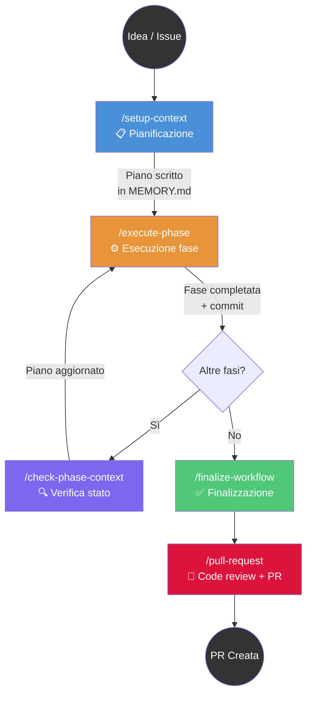
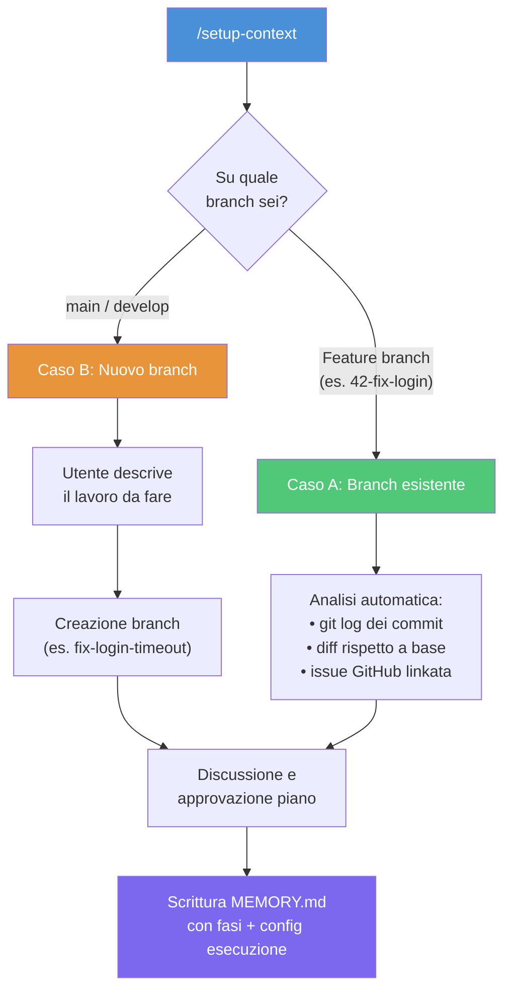
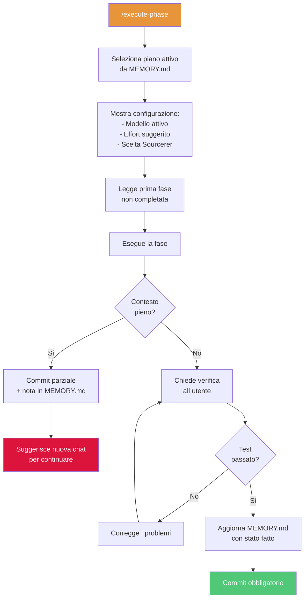
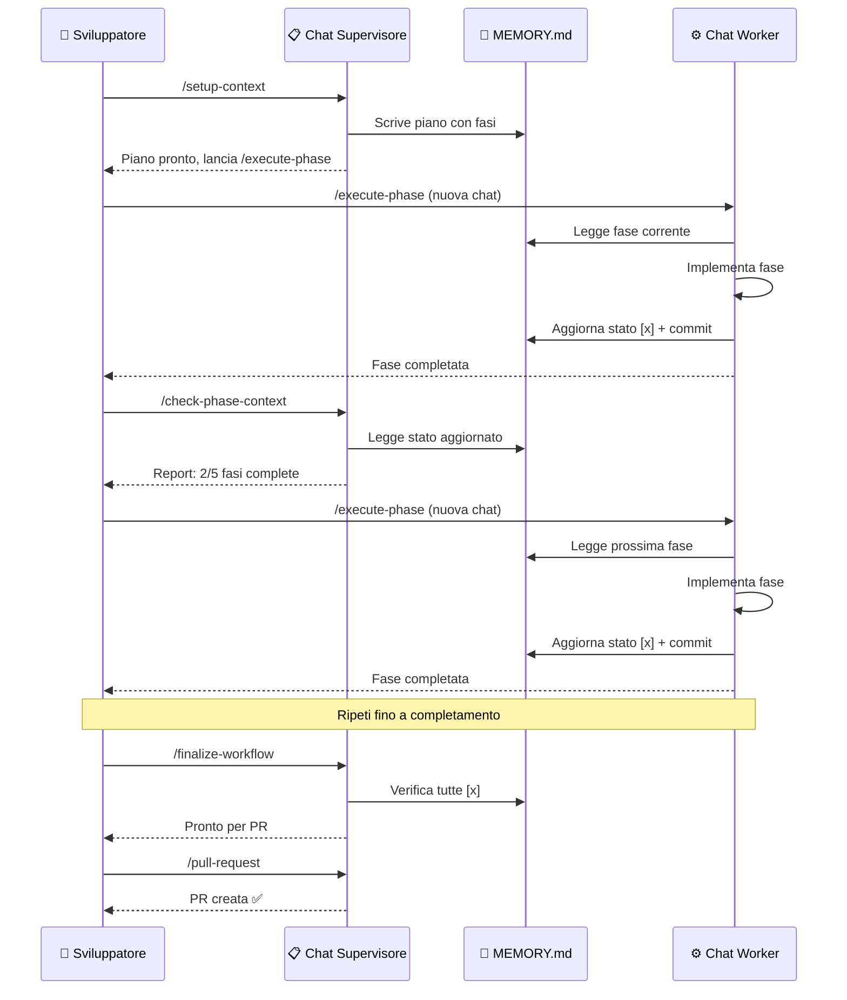

# Claude Code Phased Workflow

Un sistema di slash command per Claude Code che struttura il lavoro di sviluppo in fasi pianificate, eseguibili in sessioni indipendenti, con stato condiviso su file system.

## Il pattern: Plan-Execute-Verify

Questo workflow implementa un pattern noto nella letteratura sugli agenti AI: la **separazione tra pianificazione ed esecuzione**, con un ciclo di verifica tra le fasi.



[Apri in Mermaid Live Editor](https://l.mermaid.ai/nAuTZb)

---

## Perché questo approccio?

### Il problema: la finestra di contesto

Claude Code lavora in una finestra di contesto limitata. Quando una sessione diventa troppo lunga, il sistema compatta i messaggi precedenti, perdendo dettagli. Questo porta a:

- Codice che "dimentica" decisioni prese a inizio sessione
- Ripetizioni di analisi già fatte
- Degradazione progressiva della qualità

### La soluzione: stato su file, sessioni usa-e-getta

Invece di cercare di fare tutto in una sessione lunghissima, il workflow:

1. **Scrive il piano su file** (`MEMORY.md`) — sopravvive a qualsiasi sessione
2. **Ogni fase viene eseguita in una chat dedicata** — contesto fresco e completo
3. **Ogni fase termina con un commit** — checkpoint stabile e reversibile
4. **Una chat supervisore** verifica il progresso e può correggere il piano

Il file `MEMORY.md` è il punto di coordinamento: chi pianifica scrive, chi esegue legge e aggiorna, chi verifica controlla.

---

## È un pattern conosciuto?

Sì. Questo workflow combina diversi pattern documentati nella letteratura sugli agenti AI e nell'ingegneria del software:

| Pattern | Dove è documentato | Come lo usiamo |
|---------|-------------------|----------------|
| **Plan-and-Execute** | LangChain, LlamaIndex, letteratura accademica sugli agenti | Separazione netta tra `/setup-context` (pianifica) e `/execute-phase` (esegue) |
| **Orchestrator-Worker** | Multi-agent systems (AutoGen, CrewAI) | La chat supervisore orchestra, le chat worker eseguono |
| **Checkpoint & Resume** | Pipeline CI/CD, workflow engine (Airflow, Temporal) | Ogni fase completata = commit. Si può riprendere da qualsiasi punto |
| **Shared State via Artifact** | Blackboard architecture (AI classica) | `MEMORY.md` è la "lavagna" condivisa tra sessioni |
| **Context Window Management** | Pratica comune con LLM — documentata da Anthropic, OpenAI | Sessioni corte e focalizzate invece di conversazioni infinite |

La novità specifica di questo workflow è che **rende esplicito e controllabile dall'utente** quello che altri strumenti (Devin, Cursor Agent, Windsurf) fanno internamente in modo opaco. Lo sviluppatore mantiene il controllo su ogni fase, può verificare, correggere il piano, scegliere il modello e l'effort per ogni fase.

---

## I comandi

### `/setup-context` — Pianificazione

Il punto di partenza. Analizza il contesto e produce un piano strutturato in fasi.

**Due modalità di ingresso:**



[Apri in Mermaid Live Editor](https://l.mermaid.ai/pbJBHl)

**Caso A — Sei su un feature branch:**
Hai già iniziato a lavorare (o c'è un branch da una issue). Il comando analizza automaticamente i commit, il diff, e l'eventuale issue linkata. Poi discute con te il piano basandosi su quello che c'è già.

**Caso B — Sei su main/develop:**
Parti da zero. Descrivi cosa vuoi fare, il comando crea un branch e struttura il piano.

**Output:** un file `MEMORY.md` con questo formato:

```markdown
# Context: fix-login-timeout
Base: develop | Issue: #42

## Objective
Fix the login timeout that occurs when...

## Work Plan
- [ ] **Phase 1**: Analyze timeout root cause
  - Details: ...
  - Files: src/auth/login.py, tests/test_auth.py
- [ ] **Phase 2**: Implement fix
  - Details: ...
  - Files: src/auth/login.py

## Notes
The timeout only happens with SSO users.

## Suggested execution config
| Phase | Effort | Model | Sourcerer |
|-------|--------|-------|-----------|
| Phase 1 | high | opus | yes |
| Phase 2 | medium | sonnet | no |
```

La sezione **Suggested execution config** è una novità importante: cattura in fase di pianificazione il "peso" di ogni fase, così chi esegue sa subito quale modello e configurazione usare.

**Regola fondamentale:** questo comando non tocca MAI il codice sorgente. È solo pianificazione.

---

### `/execute-phase` — Esecuzione

Esegue UNA fase per volta, in una chat dedicata.



[Apri in Mermaid Live Editor](https://l.mermaid.ai/JXdGQS)

All'avvio mostra la configurazione suggerita dal piano:

```
─────────────────────────────────────
Fase: Analyze timeout root cause
─────────────────────────────────────
Modello attivo : claude-sonnet-4-6
Effort attivo  : (non rilevabile — usa /model per verificare)
Suggerimento da piano:
  Effort  → high
  Model   → opus
  → Se vuoi allinearti, digita /model prima di continuare.
─────────────────────────────────────
```

Questo permette allo sviluppatore di decidere se cambiare modello/effort prima di partire.

**Punti chiave:**
- **Una fase per chat** — contesto sempre fresco
- **Commit obbligatorio** a fine fase — ogni fase è un checkpoint stabile
- **Gestione proattiva del contesto** — se la chat si allunga troppo, suggerisce di salvare e continuare in una nuova sessione
- **Verifica umana** — non procede finché l'utente non conferma che il test è passato

---

### `/check-phase-context` — Supervisione

Verifica lo stato del piano rispetto al codice reale. È il comando che usi dalla chat supervisore per capire a che punto sei.

Cosa fa:
- Legge `MEMORY.md` e lo stato git (diff, commit, file non committati)
- Incrocia le modifiche con le fasi del piano
- Rileva **drift** (modifiche che non corrispondono a nessuna fase)
- Rileva **fasi sovradimensionate** (troppe modifiche per una singola fase)
- Propone **re-phasing**: split di fasi troppo grandi in sotto-fasi

Questo comando non tocca il codice — solo il file del piano, e solo se approvi un re-phasing.

---

### `/finalize-workflow` — Finalizzazione

Quando tutte le fasi sono completate:
- Verifica che ogni fase sia `[x]`
- Analizza lo stato git
- Propone strategia di commit (squash o keep)
- Genera il messaggio di commit
- Pulisce `MEMORY.md`

---

### `/pull-request` — Code Review e PR

Agisce come un maintainer esigente:
- Verifica coerenza con la issue linkata
- Controlla qualità del codice, commenti in inglese, security
- Se trova problemi **blocca** la PR e produce un report
- Se tutto ok, crea la PR su GitHub con template strutturato

---

## Il pattern Supervisore-Worker

L'aspetto più distintivo di questo workflow è la separazione tra **chi pianifica/supervisiona** e **chi esegue**.



[Apri in Mermaid Live Editor](https://l.mermaid.ai/FR3trm)

In pratica lavori con **due tipi di chat** aperti in Claude Code:

| | Chat Supervisore | Chat Worker |
|---|---|---|
| **Comandi** | `/setup-context`, `/check-phase-context`, `/finalize-workflow`, `/pull-request` | `/execute-phase` |
| **Scopo** | Pianifica, verifica, finalizza | Implementa una singola fase |
| **Tocca il codice?** | Mai | Sì |
| **Durata** | Tutta la vita del task | Una per fase (usa-e-getta) |
| **Modello tipico** | opus (ragionamento) | Varia per fase (config nel piano) |

---

## Punti di forza

### 1. Contesto sempre fresco
Ogni fase parte con una chat nuova. Niente degradazione, niente compaction, niente "ha dimenticato cosa doveva fare". Il piano su file è la memoria duratura.

### 2. Checkpoint con git
Ogni fase completata = un commit. Puoi:
- Fare `git log` per ricostruire cosa è successo
- Fare rollback di una singola fase
- Riprendere il lavoro da qualsiasi punto, anche giorni dopo

### 3. Flessibilità nel modello
La tabella `Suggested execution config` nel piano permette di usare il modello giusto per il task giusto:
- **haiku** per task meccanici (rinominare, spostare file)
- **sonnet** per sviluppo standard
- **opus** per fasi architetturali o di analisi complessa

Questo ottimizza costi e velocità senza sacrificare qualità dove serve.

### 4. Lo sviluppatore resta in controllo
Non è un agente autonomo che parte e torna con un risultato. Lo sviluppatore:
- Approva il piano prima dell'esecuzione
- Verifica ogni fase prima che venga marcata come completata
- Può correggere il piano in corso d'opera (re-phasing)
- Sceglie modello e effort per ogni fase

### 5. Piani paralleli
Se stai lavorando su due cose contemporaneamente, il workflow supporta più piani con file separati (`MEMORY.md` + `memory_<context>.md`). Ogni `/execute-phase` chiede quale piano seguire.

### 6. Tracciabilità
Tutto è tracciabile:
- Il piano è in un file versionabile
- Ogni fase ha un commit
- La PR finale ha un template strutturato
- `/check-phase-context` può ricostruire lo stato in qualsiasi momento

---

## Come iniziare

### Prerequisiti
- [Claude Code](https://claude.com/claude-code) installato
- Repository git con remote configurato
- GitHub CLI (`gh`) installato e autenticato

### Setup
1. Copia la cartella `.claude/commands/` nella root del tuo progetto (o nella tua home `~/.claude/commands/` per averla disponibile globalmente)
2. I comandi saranno disponibili come slash command in Claude Code

### Primo utilizzo
```
# Apri Claude Code nella directory del progetto
claude

# Parti dalla pianificazione
> /setup-context

# Segui i passaggi interattivi...
# Quando il piano è pronto, apri una NUOVA chat:
> /execute-phase

# Dalla chat supervisore, verifica il progresso:
> /check-phase-context

# Quando tutte le fasi sono completate:
> /finalize-workflow
> /pull-request
```

---

## Comandi ausiliari

| Comando | Uso |
|---------|-----|
| `/issue <numero>` | Carica una issue GitHub e crea contesto operativo |
| `/push-context-memory` | Sincronizza il piano su Sourcerer (knowledge base condivisa) |
| `/new_issue` | Crea una nuova issue GitHub |

---

## FAQ

**D: Posso usare `/execute-phase` senza aver fatto `/setup-context`?**
No. Il comando cerca un `MEMORY.md` con fasi da eseguire. Se non esiste, ti dice di lanciare `/setup-context` prima.

**D: Cosa succede se la sessione di `/execute-phase` si allunga troppo?**
Il comando monitora proattivamente il contesto. Quando si avvicina al limite, propone di committare il lavoro parziale, aggiornare `MEMORY.md` con una nota di progresso, e continuare in una nuova chat.

**D: Posso saltare delle fasi o cambiare l'ordine?**
Il piano è un file Markdown — puoi modificarlo manualmente. `/check-phase-context` ti aiuta a capire se le modifiche fatte corrispondono ancora al piano.

**D: Come funziona con branch che partono da una issue GitHub?**
Se il branch inizia con un numero (es. `42-fix-login`), `/setup-context` carica automaticamente la issue #42 da GitHub e la usa come contesto per il piano.

**D: Posso lavorare su più task contemporaneamente?**
Sì. Se `MEMORY.md` è già occupato da un piano attivo, `/setup-context` propone di creare un piano parallelo in `memory_<nome>.md`. Ogni `/execute-phase` chiede quale piano seguire.
