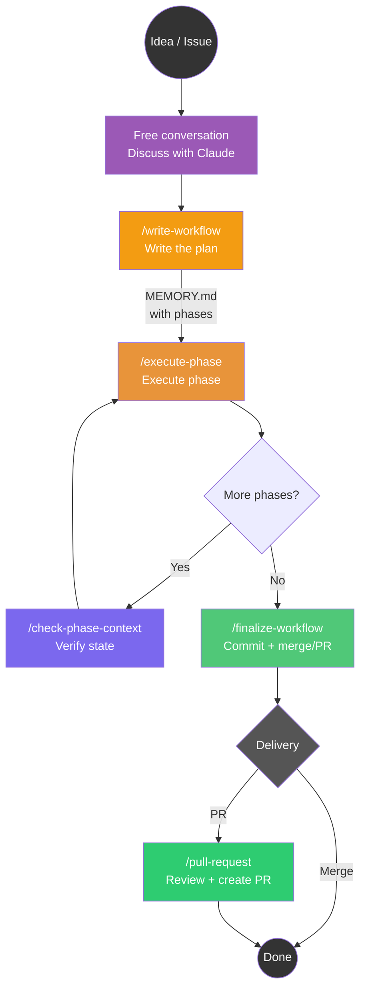

# Claude Code Phased Workflow

A slash command system for Claude Code that structures development work into planned phases, executable in independent sessions, with shared state on the file system.

## The Pattern: Converse, Plan, Execute, Verify, Finalize



> **Note:** `/create-context` is **not required** to use the workflow. It creates an isolated worktree, which is useful when you need to **parallelize** multiple tasks on the same repo. For a single task, just work directly on your branch.

---

## Why This Approach?

### The Problem: Context Window Limits

Claude Code operates within a finite context window. Long sessions lead to:

- Lost decisions from earlier in the conversation
- Repeated analysis of the same code
- Progressive quality degradation

### The Solution: File-Based State, Disposable Sessions

1. **Discuss freely** with Claude — no special format required
2. **Crystallize the plan** into `MEMORY.md` with `/write-workflow`
3. **Execute each phase in a dedicated chat** — fresh, full context every time
4. **Finalize** with a single clean commit, then PR or merge

`MEMORY.md` is the coordination point between sessions.

---

## Commands

### Core workflow (works anywhere)

| Command | When to use | What it does |
|---------|------------|--------------|
| `/write-workflow` | After discussing the plan | Writes MEMORY.md from the conversation |
| `/execute-phase` | Executing a phase | Runs the next phase from the plan |
| `/check-phase-context` | Checking progress | Read-only analysis of plan vs git state |
| `/finalize-workflow` | All phases done | Single clean commit + offers PR or merge |
| `/pull-request` | Creating a PR | Rigorous code review + PR creation |

### Context management (optional — for parallelization)

| Command | When to use | What it does |
|---------|------------|--------------|
| `/create-context <topic>` | Need isolated workspace | Creates branch + worktree + VS Code from any branch |
| `/close-context` | Done with a worktree | Close and optionally remove a worktree context |
| `/clean-contexts` | Housekeeping | List and remove stale worktree contexts |

### Auxiliary

| Command | When to use | What it does |
|---------|------------|--------------|
| `/issue <number>` | Investigating an issue | Load a GitHub issue and analyze codebase |
| `/clean-memories` | Housekeeping | List and delete old memory files |

---

## Typical Flow

### Simple (no worktree)

Work directly on your branch — ideal for a single task at a time.

```bash
claude
# Discuss the work freely with Claude...
# When the plan is clear:
> /write-workflow

# Execute phases (new chat for each — fresh context)
> /execute-phase    # Phase 1
> /execute-phase    # Phase 2

# Finalize
> /finalize-workflow
> /pull-request
```

### Isolated (with worktree)

Use when you need to **parallelize** multiple tasks on the same repo. Each worktree has its own branch, files, and MEMORY.md.

```bash
# 1. Create a workspace (from any branch)
> /create-context add PDF export for invoices

# 2. Enter the worktree and start a Claude session
cd .claude/worktrees/feat-add-pdf-export && claude

# 3. Discuss, then crystallize the plan
> /write-workflow

# 4. Execute phases (new chat for each)
> /execute-phase

# 5. Finalize and close
> /finalize-workflow
> /close-context
```

---

## How Each Command Works

### `/create-context <topic>` — Create Workspace (optional)

Creates the infrastructure for an isolated work stream. **Not required** — use it when you need to parallelize multiple tasks on the same repo.

- Works from **any branch** — the current branch becomes the "parent"
- Creates a **new branch** from the topic (e.g., "fix login timeout" → `fix-login-timeout`)
- Creates an isolated **worktree** in `.claude/worktrees/<name>/`
- Opens **VS Code** on the worktree directory (with a unique title bar color)
- Saves the parent branch in `.claude/parent-branch`

**No planning happens here.** After creating the workspace, enter the worktree and talk to Claude.

### Free Conversation — Natural Planning

After `/create-context`, open a terminal in the worktree:
```bash
cd .claude/worktrees/feat-add-pdf-export && claude
```

Talk to Claude naturally: describe what you want, explore the code together, discuss approaches. No required format, no special commands — just a normal chat.

### `/write-workflow` — Crystallize the Plan

When the discussion is mature, run this command. Claude:

1. Synthesizes the conversation into **objective + concrete phases**
2. Presents the plan for approval
3. Writes `MEMORY.md` with phases, involved files, and execution config

**Output:** a `MEMORY.md` file:

```markdown
# Context: feat-add-pdf-export
Parent: develop | Issue: #42

## Objective
Add PDF export capability for invoices...

## Work Plan
- [ ] **Phase 1**: Create PDF generator service
  - Details: ...
  - Files: src/services/pdf.py
- [ ] **Phase 2**: Add export endpoint
  - Details: ...
  - Files: src/api/invoices.py

## Suggested execution config
| Phase | Effort | Model |
|-------|--------|-------|
| Phase 1 | high | opus |
| Phase 2 | medium | sonnet |
```

The `Parent:` field is critical — it tells `/finalize-workflow` where to merge or create a PR.

### `/execute-phase` — Execute One Phase

Runs **one phase** per chat session.

Key behaviors:
- **One phase per chat** — always-fresh context
- **Never commits** (except WIP safety commit when context runs low)
- **Human verification** — waits for the user to confirm before marking done
- **Records modified files** in the `> Files:` line — source of truth for finalize

### `/check-phase-context` — Supervision

Read-only analysis of the plan vs actual code state. Detects drift, oversized phases, and proposes re-phasing. Does not touch source code.

### `/finalize-workflow` — Finalize

When all phases are complete:

1. Verifies all phases are `[x]`
2. Builds the workflow file list
3. In a worktree: `git add -A` (everything belongs to this workflow)
4. Creates a single clean commit
5. **Offers three options:**
   - **Pull request** — push and create PR toward the parent branch
   - **Merge on parent** — direct merge on the parent branch, then optionally remove the worktree
   - **Just commit** — leave as-is

The merge option is designed for the **long feature with parallel sub-tasks** pattern.

**After finalizing:** run `/close-context` to clean up the worktree, or do it after creating the PR with `/pull-request`. Either way, the worktree stays on disk until you explicitly remove it.

### `/pull-request` — Code Review + PR

Acts as a meticulous maintainer: checks issue coherence, code quality, comments in English, security. Blocks the PR with a detailed report if problems are found.

### `/close-context` — Close Worktree

Close the current worktree context. Must be run from inside a worktree. Removes the worktree directory and closes the VS Code window. **The git branch is NOT deleted** — it stays available for PRs, merges, or future work.

Options:

- **Close and remove** — remove worktree + close VS Code (recommended)
- **Close and keep** — return to the main repo, worktree stays on disk
- **Cancel** — stay in the context

Always warns about uncommitted changes and unpushed commits before removing. Branch cleanup happens separately via `/clean-contexts` after merging.

### `/clean-contexts` — Housekeeping

List all worktree contexts with their status (merged, completed, orphaned) and let the user select which ones to remove. Detects orphaned directories and shows disk space freed after cleanup.

---

## Parallel Sub-Tasks

The most powerful pattern: a large feature that requires parallel work streams.


Each worktree:
1. Has its own isolated `MEMORY.md`
2. Has its own VS Code window (different title bar color)
3. Can be worked on independently
4. Merges back to the parent feature branch when done

Conflicts between sub-tasks emerge at merge time — exactly like in a human team, but with full visibility.

---

## Key Design Decisions

### Why worktrees?

Git worktrees create isolated working directories on separate branches. Each worktree has its own file tree, so parallel workflows don't interfere. `git add -A` in a worktree is safe — everything there belongs to that workflow.

### Why no commit during phases?

`/execute-phase` never commits (except a WIP safety commit when context runs low). This gives `/finalize-workflow` full control over the final commit — one clean commit per workflow, with a proper message.

### Why a separate `/write-workflow` command?

Planning is a natural conversation. Forcing it into a structured command felt rigid. Now you just talk to Claude, then `/write-workflow` captures the result. The plan comes from the discussion, not from a template.

### Why merge instead of cherry-pick?

When finalizing a sub-task worktree, merging the feature branch into the parent is cleaner than cherry-picking. It preserves history, avoids duplicate commits, and makes the merge visible in `git log`.

---

## MEMORY.md Format

```markdown
# Context: <branch-name>
Parent: <parent-branch> | Issue: #<number>

## Objective
[2-3 sentences describing the goal]

## Work Plan
- [ ] **Phase 1**: <title>
  - Details: <what to do>
  - Files: <involved files>
- [x] **Phase 2**: <title>
  > Done: what was accomplished
  > Files: path/to/file1.py, path/to/file2.py

## Notes
[Constraints, dependencies, attention points]

## Suggested execution config
| Phase | Effort | Model |
|-------|--------|-------|
| Phase 1 | medium | sonnet |
```

### Phase States

- `[ ]` — to do
- `[x]` — completed (must have `> Files:` line)
- `[!]` — completed with issues
- `[~]` — blocked

---

## Strengths

### 1. Always-Fresh Context
Each phase starts with a new chat. No degradation, no compaction, no "forgot what it was doing." The plan on file is the durable memory.

### 2. Git Checkpoints
Each finalized workflow = a clean commit. You can `git log` to reconstruct what happened, rollback, or resume from any point.

### 3. Model Flexibility
The `Suggested execution config` table lets you choose the right model per phase:
- **haiku** for mechanical tasks (rename, move files)
- **sonnet** for standard development
- **opus** for architectural analysis or complex multi-file phases

### 4. Developer Stays in Control
This is not an autonomous agent. The developer:
- Discusses the plan before execution
- Verifies each phase before marking it done
- Can correct the plan mid-stream (re-phasing)
- Chooses model and effort per phase

### 5. Parallel Workflows
Two approaches:
- **With worktrees** (recommended for parallelization): `/create-context` for each task. Each worktree has its own MEMORY.md, VS Code window, and branch.
- **Without worktrees**: if `MEMORY.md` is already occupied, `/write-workflow` creates a parallel plan in `memory_<name>.md`.

### 6. Full Traceability
Everything is traceable: plan in a versionable file, single clean commit per workflow, structured PR template, `/check-phase-context` reconstructs state at any time.

---

## Getting Started

### Prerequisites
- [Claude Code](https://claude.com/claude-code) installed
- Git repository with remote configured
- GitHub CLI (`gh`) installed and authenticated
- (Optional) VS Code with `code` in PATH

### Installation

**Option A — Install from marketplace (recommended):**

Add the marketplace and install the plugin directly from Claude Code:
```bash
claude plugin marketplace add fporcari/claude-phased-workflow
claude plugin install phased-workflow@fporcari/claude-phased-workflow
```

Or from inside a Claude Code session:
```
/plugin marketplace add fporcari/claude-phased-workflow
/plugin install phased-workflow
```

**Option B — Install for a specific project:**

Add to your project's `.claude/settings.json`:
```json
{
  "plugins": {
    "marketplaces": ["fporcari/claude-phased-workflow"],
    "installed": ["phased-workflow@fporcari/claude-phased-workflow"]
  }
}
```

**Option C — Copy commands manually:**
```bash
git clone https://github.com/fporcari/claude-phased-workflow.git
cp -r claude-phased-workflow/plugins/phased-workflow/skills/*/SKILL.md ~/.claude/commands/
```
Note: when copying manually, rename each `SKILL.md` to `<command-name>.md` (e.g., `create-context.md`).

### First Use

```bash
claude
# Discuss your task with Claude, then:
> /write-workflow
# New chat for each phase:
> /execute-phase
# When all phases are done:
> /finalize-workflow
```

---

## FAQ

**Q: Can I use `/execute-phase` without `/write-workflow`?**
No. The command looks for a `MEMORY.md` with phases to execute.

**Q: What if the session gets too long?**
`/execute-phase` monitors context proactively. It proposes a WIP safety commit and suggests a new chat.

**Q: Can I skip or reorder phases?**
Yes. The plan is Markdown — edit it. `/check-phase-context` verifies consistency.

**Q: Does `/create-context` only work from develop?**
No — any branch. The current branch becomes the parent. This enables parallel sub-tasks.

**Q: Is VS Code required?**
No. The worktree is created regardless. Use any editor.

**Q: Do I need `/create-context` to use the workflow?**
No. `/create-context` is optional — it creates an isolated worktree, which is useful for parallelizing multiple tasks. For a single task, just work directly on your branch. The entire workflow (`/write-workflow` → `/execute-phase` → `/finalize-workflow`) works without worktrees.

**Q: How do I clean up old worktrees?**
Use `/clean-contexts` from the main repo. It lists all worktrees with their status and lets you select which to remove. Or use `/close-context` from inside a specific worktree.

---

## Known Patterns

| Pattern | Origin | How We Use It |
|---------|--------|---------------|
| **Plan-and-Execute** | LangChain, LlamaIndex | Conversation → `/write-workflow` → `/execute-phase` |
| **Checkpoint & Resume** | CI/CD pipelines | Each workflow = clean commit. Resume from any point |
| **Shared State via Artifact** | Blackboard architecture | `MEMORY.md` as shared state between sessions |
| **Context Window Management** | LLM best practices | Short, focused sessions instead of infinite conversations |
| **Worktree Isolation** | Git best practices | Each workflow in its own worktree |

The key innovation: making **explicit and user-controllable** what other tools (Devin, Cursor Agent, Windsurf) do internally and opaquely.

---

## License

MIT
