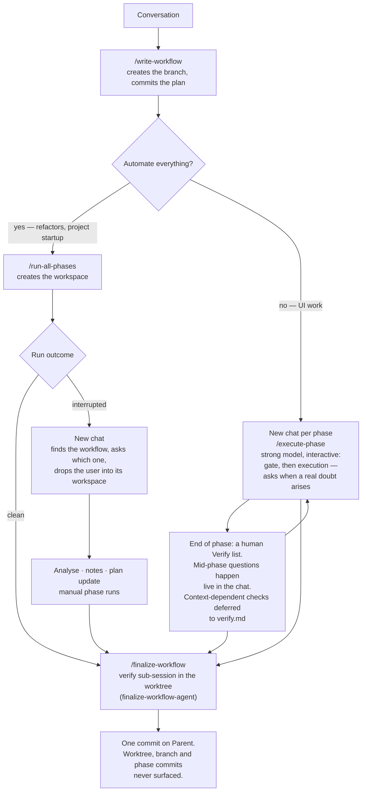

# Target workflow — design notes

Captured from the design conversation of 2026-07-27, while 4.1.0
(`wf/review-hardening-4-1-0`) was running; revised the same day after a follow-up
discussion (manual-mode mechanics, tag retirement, the finalize agent). These notes are
the intended input to a future `/write-workflow`; they are not a plan yet.

The goal in one sentence: **the user talks about the work, decides once whether to
automate it, and never learns that branches, worktrees and per-phase commits were
involved.** Git mechanics are the chain's business, not the user's — except at
finalize, where choosing the base is a real decision.

## The flow

## Step by step: today vs target

| Step | Today | Target | Gap |
|---|---|---|---|
| Conversation | works | — | — |
| `/write-workflow` | branch + plan **+ worktree** | branch + plan **only** | worktree moves to execution |
| "Automate everything?" | inferred — interactive unless the user says robottino, and the skill is told *don't ask* | an **explicit** question, asked before the plan is written (it selects the format) | new fork |
| `/run-all-phases` | must be launched from inside the plan's root | launched from anywhere; creates-or-attaches the workspace | plan location + workspace lifecycle |
| Walking away | the loop is a child of the Claude app process tree | notification when it ends, or when a phase goes `[!]` | notification, not detachment — see D2 |
| `/execute-phase` (manual mode) | one approval gate, then runs; verification burden lands on the user per phase, often on trivial or context-dependent checks | bigger phases bounded by "something demoable exists"; strong model; questions asked live as they arise (a trivial "try this" interruption stays a sizing defect, see J3); a human `Verify:` list at the end | item J |
| Interrupted run | nothing finds it from another chat | find the workflow across worktrees **and branches**, ask which, drop the user in, analyse, repair by hand | the largest missing piece |
| `/finalize-workflow` | must run where the branch is checked out | runs from anywhere; squashes onto `Parent:`, removes the worktree, leaves the user in the main repo | plan location + cleanup |

## Work items

**A0 · Retire `/check-phase-context`, absorbing its audit into `/resume-workflow`.**
Must land **before** A and B, or we pay to migrate a skill we are about to delete.

Its four steps are, in order: find the plan and the base; attribute the work; report;
apply an approved re-phasing. Steps 1, 3 and 4 are literally `/resume-workflow`'s
locate → analyse → update-the-plan. Keeping both means maintaining the same analysis
prose in two files, which is the exact failure `refs/common.md` was created to end and
that `S14` exists to catch.

Its advertised read-only guarantee is already soft: the frontmatter carries `Edit`, and
step 4 edits the plan and commits it. The real property is "read-only *on source
code*", which `/resume-workflow` keeps for free — manual phase runs go through
`/execute-phase` or `/auto-phase`, which are separate skills with their own gates.

**What must not be lost is step 2.** It compares each `[x]` phase's commit against its
own `> Files:` note and separates two kinds of drift: files inside the commit but
missing from `> Files:`, and uncommitted leftovers with no `[>]` phase to explain them.
That check is load-bearing, not cosmetic: `> Files:` is the input to red-baseline
attribution (the Case A reopen) and to `/repair-phase`. A wrong `> Files:` makes the
chain mis-attribute a regression silently. Port step 2 verbatim into
`/resume-workflow`'s analysis, including the oversized-phase judgment and its `vast` /
`group:N` exemption (after H retires the tags, only `vast` remains of it).

The healthy-workflow case ("just tell me where we are") is not a reason to keep it:
`/resume-workflow` can early-exit with the state report and nothing to resume. Its
`description` must say so, or it will not trigger when nothing is broken.

Retirement follows the path `b0fb06e` already established for the four worktree
commands: remove the skill directory, drop it from `tools/kb-sync.py` MAPPING (`S16`
asserts every shipped skill is mapped), add it to `RETIRED_NAMES` in `install.sh` so a
stale `~/.claude/commands/check-phase-context.md` stops answering, and update the seven
prose references — `README.md` (the mermaid diagram, the command table, its own
section, the traceability claim, the FAQ answer), `refs/common.md` (twice) and
`article-medium.md`.

**A1 · Rename `/run-all-phases` to a workflow-scoped name.** Groups with A0: both make
the command surface regular before anything else touches it.

The set has two nouns and splits by scope — `write` / `import` / `finalize` / `resume`
act on the workflow, `execute` / `auto` / `repair` on one phase. `run-all-phases` is the
only command whose scope is the whole workflow but whose name is built from phases plus
a quantifier. The target flow is workflow-centric (`write-workflow` → *this* →
`resume-workflow` → `finalize-workflow`): a mechanical name in the middle of a lifecycle
vocabulary is the same leak as the worktree the user does not want to notice.

Cost is distribution, not code, and `b0fb06e` already established the path: rename the
skill directory and the launcher script, `tools/kb-sync.py` MAPPING (+ `S16`),
`RETIRED_NAMES` in `install.sh`, `RUNNER_SRC` in `tests/orchestration/run_tests.sh`,
`tests/benchmark/bench.sh`, and the prose in `README.md`, `docs/loop-engineering.md`,
both `refs/*.md` and `article-medium.md`. Cannot be done during a run that is itself
rewriting those files.

**A · Plan location service.** One function, in `next-phase.py`, that finds every
workflow plan reachable from this repo:
- under the current root's `.phased/active/`;
- under any linked worktree's (`git worktree list --porcelain`);
- on any `wf/*` branch that has no worktree, read **without checking it out**
  (`git ls-tree <branch> .phased/active/`).

Returns, per plan: path, branch, worktree (or none), phase counts, whether a phase is
`[>]`/`[!]`/`[~]`. More than one → the caller disambiguates. This is the keystone: six
skills call `--resolve` today (`auto-phase`, `check-phase-context`,
`finalize-workflow`, `pull-request`, `repair-phase`, `run-all-phases`) and all six are
blind outside their own root. Fixing it in one skill's prose fixes one of six. After A0
the count is five, one of them new (`/resume-workflow`).

**B · Skills operate on the plan's root, not their own cwd.** Resolution is not
enough: `/finalize-workflow` runs `git reset --soft` and commits, which must happen on
the plan's branch. From outside, every git command needs `git -C <plan root>`. Touches
the git invocations inside all six skills. This is broader than A and was initially
underestimated.

**C · Workspace lifecycle.** `/write-workflow` stops creating the worktree.
`/run-all-phases` and the recovery path create-or-attach it. `/finalize-workflow`
removes it. The `cp` of `.claude/settings.local.json` into the worktree moves along
with creation — the sub-sessions need it for their permissions.

**D · The automation fork.** `/write-workflow` asks once, explicitly, and the answer
selects the plan format (autonomous plans need the stricter refinement and the
execution config table). It has to be asked *before* the plan is written, not after,
or an interactive plan gets rewritten into an autonomous one.

**DECIDED — DONE in 5.1.0.** The fork is one `AskUserQuestion` in `/write-workflow`'s
new Step 2, recommended-first, the recommendation derived from the work just discussed
(UI → interactive; heavy refactor, project startup, mechanical migration → autonomous).
The answer writes an explicit `Mode:` header — `Mode: autonomous` / `Mode: interactive` —
and routes the rest of the skill. The header is single-source: `/write-workflow`'s Step 2
states the question and the derivation rule once; `/run-workflow`'s pre-flight and
`/import-workflow` point at it rather than restating it, so there is no second copy to
drift (S24 guards this). `next-phase.py --validate` learned `Mode:` semantics: unknown
value → error naming it, no header → interactive (legacy plans stay legal),
`Mode: interactive` plus a config table → warning (a half-converted plan). *Rejected:* a
fixed default with no question — it is exactly the "interactive by default; don't ask"
clause the fork replaces, and it let an interactive plan be silently converted; and
duplicating the derivation rule into each consumer, which S24 now forbids.

**E · Notification.** A proactive notification on run end, and on the first `[!]`,
without waiting for the end.

**DECIDED — DONE in 5.1.0.** Three stable `EVENT:` lines on the launcher's stdout —
`phase-failed <N>`, `phase-blocked <N>`, `run-end <status> <done>/<total>` — and nothing
else becomes an event, because every token is a potential notification. `/run-workflow`
launches the run in the background teeing to a log under `${TMPDIR:-/tmp}/phased-workflow/`,
watches the log with one persistent Monitor filtered to those tokens (self-terminating on
`run-end`), and pushes on the first `phase-failed`, on any `phase-blocked`, and once at the
end (the end push comes from the background command's own completion, so there is exactly
one source per notification). Without Monitor/PushNotification it degrades to a foreground
run reporting once at the end. S25 guards the contract both live and statically. *Rejected:*
an event file inside `.phased/` — it dirties the tree at the next phase's start and lands
inside that phase's commit, breaking the clean-tree invariant red-baseline attribution rests
on, so the events go to stdout and the log lives outside the repo; `osascript` in the
launcher — the launcher must stay silent under the test suite, and the local ping belongs to
`/execute-phase` where the user is present; and detachment (per D2) — a detached run has no
session to notify from.

*Amended right after the release, on the user's decision:* where a notification lands
(desktop, phone, anything else) is the user's own setup, managed by hand — never named
and never offered by this chain. What survives is the mechanism: the events, the
background run, the Monitor and the pushes. The one operational line that stays in the
confirmation is purely mechanical — the run is attached to the launching session, so
the app must stay open.

**F · ~~Transcripts to log only~~ — DROPPED, the premise was wrong.** The claim was
that `claude -p ... | tee log/phase-N.txt` pours each sub-session's full transcript into
the launching chat's context. Measured on the 4.1.0 run: the per-phase logs are **1–2 KB
each, ~12 KB for nine phases**, because `claude -p` prints only the final message, not
the conversation. There is nothing to optimise here. Macro 2 loses this item.

**F2 · Every phase commits — always. FIXED in 4.1.0**, kept here for the lesson, not as
work. Found by running 4.1.0, and the most serious defect of the set. `LIGHT_PROMPT` in
the launcher ended with **"Never commit."**, a leftover from before `2cfa53b` (*one
branch per workflow… one commit per phase*), when phases genuinely did not commit and
`/finalize-workflow` squashed a dirty tree. The full contract and the `auto-phase` skill
were updated for the new architecture; the light one was not. So every `Effort=low`
phase silently left its work uncommitted.

The cascade is worse than the direct effect. On the 4.1.0 run, phases 4, 5 and 7 (light)
did not commit "as instructed" — and then phase 6, a `medium` phase running the **full**
skill that should have committed, wrote: *"this repo is driven in no-commit mode… No
commit made, following the no-commit mode this run has used for Phases 4 and 5."* One
mode's constraint leaked into another through the observable state of the repo.

What broke: the per-phase checkpoint (nothing to roll back to); the clean-tree invariant
the baseline check relies on; and **silently, red-baseline attribution** — Case A matches
failures against the `> Files:` notes of *committed* phases, and four phases fused into
one dirty tree have no boundary to attribute to. It also made the README's per-phase
commit claim false for low-effort phases.

Fixed as intended, inside 4.1.0: the clause is gone — `LIGHT_PROMPT` now ends with the
commit requirement (`wf(phase N): <title>`, including the plan's own status update,
exactly as `auto-phase` does) — and `S14`, which already extracts the shipped contracts,
guards it: it asserts `LIGHT_PROMPT` does *not* contain "Never commit" and *does* carry
the commit clause. Macro 2 no longer lists this item.

**J · Manual mode is a first-class mode, not "autonomous minus the robot".**
`/write-workflow` asks the intent explicitly (item D) and the answer changes the plan's
shape, not just its header. The user's own heuristic: UI work is manual; heavy refactors
and project startups are autonomous.

*Phase boundary.* In autonomous mode a phase is one concern, ~6-8 files, closed by a
re-runnable `Done:`. In manual mode the boundary becomes **"something a human can look at
exists"**. Phases get bigger as a consequence rather than as a goal, and — the point — a
trivial verification step cannot arise, because no phase closes on half a button.

*Two verification fields.* `Done:` today is the loop's exit condition and must stay
machine-re-runnable; for a UI phase it is a stretch, which is exactly why the autonomous
reference forbids `sonnet` there. Manual mode splits it:
- `Done:` — tests, lint, build. Still the exit condition.
- `Verify:` — steps a person performs, each with its expected result.

*Every `Verify:` step carries a **when***: `now`, or `deferred: needs Phase M`. This is
the mechanism for "checks that only make sense in a wider context" — they are dated, not
skipped. Deferred steps accumulate in `.phased/active/<slug>/verify.md`, which grows per
phase and which `/finalize-workflow` presents as one QA pass. Same shape as the
`review.md` that the autonomous coherence phase already writes — copy that precedent.

*Split `Verify:` by who can check it.* The `ui-test` skill already drives a real browser
and can act as the verifier in a convergence loop. So: what a browser agent can assert
(the flow works, the record persists, the grid reloads) never reaches the human list;
only what needs human judgment does (aesthetics, "is this interaction right?", UX
ambiguity). Without this split the human list fills with automatable work and the whole
point is lost.

*Behavioural rule for `/execute-phase`:* interruptions follow J3. A question that needs a
**decision** is asked live, in the chat, and execution resumes with the answer; asking the
user to **try something trivial** mid-phase is the symptom of a phase that is too small,
and the cure is sizing, not a ban on questions — manual verification steps belong in
`Verify:` at the end. Execution stays on a strong model — `opus` floor, never `sonnet`,
which matches the existing rule for UI and declarative work.

*The cost, to be chosen deliberately:* bigger phases fight the premise the architecture
rests on — phases are small because context fills up. The resume path (`[>]` plus a
`> WIP:` note) exists but is today an exception; with manual-mode sizing it becomes
load-bearing. Payable, but it means the resume path needs real test coverage rather than
standing as a theoretical safety net.

**J2 · Manual mode is not the loop: one interactive chat per phase.** Rewritten after the
follow-up discussion of 2026-07-27. The first version made manual mode "the same loop with
a human gate between phases" — a parent chat launching each phase in a `claude -p`
sub-session, stopping between phases. It died on its own caveat: a sub-session cannot ask
a question, and asking is exactly what manual mode exists for (J3). The `> Question:`
boundary-deferral it invented was a workaround for a sub-session that could not speak;
both are dropped.

The settled model: **the user opens a new chat per phase and runs `/execute-phase` there.**
Fresh context per phase comes from the new chat; interactivity is native. The skill's
existing approval gate — one message stating what the phase will do and which files it
touches, open questions batched, one approval — already *is* the "quick brainstorm, then
confirm" this mode wants; nothing new to build there. A real doubt mid-phase is asked live
in the chat, answered, and execution resumes; verification and the phase commit close the
phase. `/execute-phase` is not redundant — it is the heart of manual mode.

*The cost this re-accepts:* a big manual phase runs in one chat, whose window can fill.
The first version's sub-sessions had retired J's context-cost concession; it is back. The
`[>]` + `> WIP:` escape hatch returns to being load-bearing and needs real test coverage
rather than standing as a theoretical safety net — which is why manual mode pairs with G
in the macro split.

*Correction to J:* `Verify:` is not manual-only. In autonomous mode it is thin — the tests
carry the verification — but not empty: "project startup", one of the stated autonomous
cases, still wants human eyes on the result. One mechanism, thick in manual and thin in
autonomous, beats two parallel ones that drift.

*And `review.md` is not a test plan.* `> Review:` notes plus the coherence phase's
`review.md` say "here is what I noticed and will not decide for you" — the user reads and
judges. `verify.md` says "here is what you must exercise" — the user does. Sibling
artifacts; `/finalize-workflow` presents both.

**J3 · The modes differ by *when decisions get made*, not by whether execution
interrupts.** The semantics J and J2 now build on. In manual mode "stop and ask" is
literal: the phase runs in an interactive chat (J2), so the question happens in-flight,
not at a boundary.

| | autonomous | manual |
|---|---|---|
| where decisions are made | **all of them in `/write-workflow`** — every question anticipated, because nobody will be there to answer | **as they arise**, during the phase |
| plan depth | prescriptive, nothing left to infer | intent-level |
| phase size | one concern | as far as something worth testing |
| doubt mid-phase | nobody can answer → `[!]` / `[~]` | **stop and ask** |

So the `auto` flag does not mean "do not disturb". It means **"you are in an environment
where there is nobody who can answer you"**. It does not change the willingness to ask,
it changes whether asking is possible. Everything else follows: autonomous plans must
pre-answer questions because there is no interlocutor, and an unresolvable doubt becomes
a state in the plan rather than a question.

Two kinds of interruption, and only one is a defect:
- to make a **decision** on a large task — wanted, keep it;
- to **try something trivial** — the symptom of a phase that is too small. The cure is
  sizing, not a ban on questions.

*Consequence: `group:N` is a workaround, not a feature.* The user's own example of a
manual phase — "customer and supplier master tables with their UI" — is verbatim the
canonical `group:N` example in `write-workflow/SKILL.md`, where the sizing rule **splits**
model from UI and `group:N` then **stitches them back** so they can be tested together. If
the manual phase boundary is "something testable exists", nothing is left too small to
test alone and `group:N` becomes superfluous in manual mode. `parallel:N` is inert in
autonomous mode, `group:N` is a symptom in manual mode — neither survives; H is now their
retirement.

**K · One launcher, two callers: run a shipped skill in a sub-session at the plan's root.**
`/finalize-workflow` has the same problem `/run-all-phases` had — in the worktree case the
user must first enter the worktree — and the same fix. A launcher resolves the plan (A),
cds to its root (B), and runs `claude -p "/<skill>-agent"`; the report comes back to the
chat the user is already in.

**DECIDED for finalize:** `/finalize-workflow` silently opens the sub-session in the
plan's worktree when one exists, running `finalize-workflow-agent` — exactly the
mechanism the robot uses per phase. The parent chat presents the findings, asks the
decisions (base, worktree removal, final commit wording), squashes and cleans up.

*Fact-check on the current skill:* today `finalize-workflow/SKILL.md` contains no
`claude -p` at all — the review runs in-session via the `code-review` skill, and the
"read-only reviewer panel" it describes is not even enabled by its own frontmatter
(`allowed-tools` carries `Skill` but no Agent tool — an inconsistency worth fixing on its
own). So K is a real build for finalize, not a refactor of something half-there.

*Why this beats "open a new chat" or "spawn a subagent I prompt":* the sub-session's prompt
is **shipped in the launcher, not composed by the calling chat** — the property that makes
the `/goal` contracts trustworthy and that `S14` protects. Independence becomes structural
rather than a matter of the caller's honesty. A hand-prompted subagent has the opposite
property: whoever writes the prompt controls what gets reviewed.

*Amendment to the idea as first stated:* the sub-session must be **read-only**. Finalize
needs decisions only the user can make — base branch, whether to remove the worktree, the
final commit's wording — and a sub-session cannot ask. It also must not run `git reset
--soft` unattended. Split it the way `phase-verifier` is split:
- sub-session, clean context, at the plan's root: verify every phase's `Done:`, review the
  whole diff, return classified findings. Never touches history.
- parent chat, where the user is: present the findings, ask the decisions, squash, clean up.

*Consolidation:* this is not finalize machinery, it is a generic piece — "run a shipped
skill in a sub-session at the plan's root and bring back the report". `run-workflow` uses
it once per phase; finalize once. One launcher, two callers. It also makes A and B
load-bearing for both callers, not just for the run.

*Naming:* it must be a **skill invoked via `claude -p`**, not a subagent. A subagent
inherits the parent's cwd — the very problem being solved.

**L · The `-agent` suffix as a convention: the name states the environment, not the
behaviour.** `execute-phase` / `execute-phase-agent`, `finalize-workflow` /
`finalize-workflow-agent`, and — the only currently dual-use command — `repair-phase` /
`repair-phase-agent`, since the launcher runs the first repair unattended while the user
runs the second deliberately. Better than `auto-`, which describes a mode of behaving;
`-agent` says *"there is nobody in here who can answer you"*, which is the J3 semantics and
implies the rest of the contract: pre-answered questions, state markers instead of
questions.

*The risk, and it is the one this repo keeps losing to.* If `-agent` means a second file
carrying the same body, it recreates tonight's defect exactly — `LIGHT_PROMPT` keeping
`Never commit` while its sibling contract was updated. The convention holds **only if the
`-agent` variant is thin**: it states the unattended constraints and delegates the work to
the shared skill.

*So it needs a guard, or it is only an intention:* a static check that an `-agent` skill
does not duplicate its base — a line ceiling, or a required reference to the base skill.
Same family as `S14`/`S15`/`S16`.

*Collision to handle:* the user's own global `CLAUDE.md` states that `/auto-phase` is
something they launch ("launching them IS the approval"). Renaming it to
`execute-phase-agent` declares "not for you" about a command they type. Not a blocker —
typing `execute-phase-agent` by hand is simply running the unattended variant
deliberately, which stays legitimate — but the rename carries a `CLAUDE.md` update with
it. Otherwise a line survives naming a command that no longer exists, which is the exact
defect `RETIRED_NAMES` in `install.sh` exists to catch.

**G · Recovery.** From any chat: locate the interrupted workflow (A), ask which one if
several, attach or create its workspace (C), then analyse and repair —
- `[>]` stale: report its age and `> WIP:` note, offer to reset it to `[ ]`;
- `[!]`: read `> Issue:` / `> Attempted:` and the phase log, propose the next move;
- `[~]`: name the red baseline nobody owns and what it takes to clear it;
- support hand edits to the plan and manual phase runs, each with its own `wf:` commit
  (the plan is tracked — the clean-tree invariant depends on this).

**H · Retire `parallel:N` and `group:N` — DECIDED.** First stated as "`parallel:N` is
interactive-only, plus a validator warning"; the follow-up discussion went further:
neither tag has a surviving habitat, so both are retired. `vast` stays.

The rationale, per mode. In autonomous mode the launcher runs one `claude -p` per
iteration, sequentially, so `parallel:N` never produces concurrency; its only effect is
relaxing the eligibility barrier, and that path is unreachable — the one situation where
it would matter, a preceding phase not `[x]`, is exactly when the launcher stops for
repair. In manual mode (J2) execution is one interactive chat per phase, sequential by
construction, so `parallel:N` has nothing to parallelise there either. And `group:N` is a
symptom, not a feature (J3): with the manual phase boundary at "something testable
exists", nothing is left too small to test alone, and in autonomous mode
`refs/write-workflow-autonomous.md` already forbids it in practice ("interactive-only …
prefer splitting").

The blast radius is larger than one prose rule — worth sizing honestly:
- `skills/write-workflow/SKILL.md` — tag rules and the plan-format examples that carry
  `parallel:1` / `group:1`;
- `skills/execute-phase/SKILL.md` — the group-unit invocation (`unit: N,M`), the per-phase
  gate repetition inside a unit, `> Grouped:` closure, the `wf(phase N-M):` unit commit;
- `refs/common.md` — the concurrency caveat, the `parallel:N` eligibility barrier, the
  group-unit selection rule;
- `refs/write-workflow-autonomous.md` — the `group:N` interactive-only note;
- `scripts/next-phase.py` — `TAG_RE`, the `Phase.parallel` / `Phase.group` accessors, the
  malformed-tag message, the docstring;
- `scripts/run-all-phases.sh` — comments plus the fallback NOTE that names both tags;
- `tests/orchestration/run_tests.sh` — S20a asserts that fallback NOTE verbatim (the only
  test touching the tags);
- `skills/check-phase-context/SKILL.md` mentions both, but A0 retires that skill anyway —
  keep the ordering (A0 first) so nothing is migrated just to be deleted.

**M · Known defects carried out of 4.1.0.** Found by an independent whole-diff review at
finalize, deliberately not fixed in that release. Two were proven by mutation.

*Should fix:*
1. `next-phase.py --validate` does not implement two warning rules its own phase Decisions
   specified: both `group:N` and `parallel:N` on one phase, and `group:N` on a
   `Mode: autonomous` plan. Verified: a plan carrying both tags returns `0 warning(s)`. The
   phase's `> Done:` note claims every rule from the Decisions is implemented — that
   sentence is false. **Resolved by H:** both tags are retired, so the two missing warning
   rules are cancelled rather than implemented. The false `> Done:` claim stays on record
   as a process fact — a phase declared complete against Decisions it did not fully
   implement, and the coherence phase did not catch it.
2. The launcher captures the validator's output and prints it **only** on non-zero exit, so
   every `warning:` line is computed and discarded. The two-severity design ships
   half-mute — including the warning for a prose `- [!]` bullet in `## Notes`, precisely the
   defect class 4.1.0 advertises fixing.
3. `S18`'s static guard skips any line without `grep`, so `first_bang_block`'s two awk
   patterns have **zero** coverage — despite the phase naming them explicitly. Proven by
   mutation: reverting both awk patterns to their pre-4.1.0 form leaves the suite at
   109/109. Half of the flagship fix is unprotected against regression.

*Minor:*
4. `S21`'s mutation check re-implements the guard's Python inline instead of re-running the
   guard under test, so it proves that a *copy* of the logic fails.
5. The `> Verified:` note field the phases invented is in no documented set, so the release
   ships a validator that warns on its own plan. Related: `NOTE_RE` cannot distinguish a new
   note field from a wrapped continuation line of a `> Done:` note that happens to begin
   `Capitalised:` — a designed-in false positive.
6. `run_tests.sh`'s own header still describes S1–S16; S17–S21 are absent from it.
7. `README` and `docs/loop-engineering.md` miscount the scenarios: S18 is listed as static
   two sentences after being described as live, and "twenty-one scenarios exercised with a
   mock" includes five that never invoke the mock.

*One process lesson worth more than the items.* The finalize review was delegated to a
reviewer with no stake in the work, given only the plan and the diff and none of the
author's intent. It found three should-fixes the authoring sessions and the in-plan
coherence phase both missed, and proved two of them by mutation. Mutation testing — revert
the change, confirm the suite goes red — is what separated "there is a guard" from "the
guard covers this". Worth making a standing part of the finalize review, not a one-off.

## Proposed macro split

Eight items is past the ~8-10 ceiling for one wave, and two of them only become
writable once the first lands. Rolling wave, three macros:

- **Macro 1 — Command surface, location and workspace** (A0, A1, A, B, C, H, K, L) —
  **DONE in 5.0.0** (`wf/command-surface-5-0-0`), together with M.2–M.6 and the M.7
  count fixes. The
  foundation: without it nothing else is reachable from outside the plan's own
  directory. A0 and A1 go first, so that A and B never migrate a skill destined for
  deletion or for a new name. H is no longer one prose rule — retiring both tags touches
  two skills, both refs, the selector, the launcher and S20a — but it still belongs here,
  next to the files Macro 1 already opens.
- **Macro 2 — Unattended run** (D, E) — **DONE in 5.1.0** (`wf/macro2-unattended-run`).
  The "I have to do the shopping" path. (F2 was fixed inside 4.1.0 and left this list.)
- **Macro 2b — Manual mode** (J, J2, J3) — **DONE in 5.2.0, minus the resume hardening.**
  Landed: the `Verify:` mechanics with the *when* (`now` / `deferred: needs Phase M`),
  `verify.md` accumulating the deferred checks and presented by `/finalize-workflow` as one
  QA pass, the `ui-test` split that keeps automatable checks off the human list, the
  interactive phase boundary at "something a human can look at exists", and
  `/execute-phase`'s ask-live rule with its `opus` floor. The contract is single-source in
  `refs/common.md` → *Verification*, cited by its three consumers, guarded by S27 with a
  mutation proof.
  *Not landed, deliberately:* the resume path. Bigger in-chat phases make `[>]` / `> WIP:`
  load-bearing and it still has no real test coverage — that pairs with G, so it moves to
  Macro 3 rather than being claimed here.
  *Shipped without the chain:* written in one session on the user's request ("fai al volo"),
  so with no independent finalize review and no coherence phase — the thinner safety net is
  a fact about this slice, not a property of the items.
  *Amended in 5.2.1:* the missing review happened after the fact — an adversarial pass over
  the whole 5.1.0–5.2.0 range (guards mutation-tested, shipped contracts executed) found
  and fixed what the thinner net let through; see README → *What changed in 5.2.1*.
- **Macro 3 — Recovery** (G) **plus the resume hardening inherited from 2b**. Depends on
  Macro 1's location service; benefits from Macro 2's status output.

## Open decisions

**D1 · Recovery is its own skill — DECIDED: `/resume-workflow`.** And
`/check-phase-context` is retired into it rather than kept alongside, because its four
steps are a strict subset of the new skill's analysis. See A0 for the retirement path
and for the one step that must be ported verbatim.

**D2 · Detachment is probably not needed.** The original worry was that the loop dies
with the Claude app, since it lives in the app's process tree. But "I have to do the
shopping" means the user leaves the house, not that the Mac shuts down. If the app
stays open, the run survives and a live session can send the notification. Full
detachment (`setsid` + a status file) would break that: a detached run has no session
to notify from, which is what dragged an external push service into the discussion for
no reason. **Prefer attached.** Revisit only if a run must survive a reboot.

**D3 · When the branch is already checked out in the main repo,** `git worktree add`
refuses. The recovery and run paths would have to move the main repo's HEAD back to
`Parent:` first. Announce it in one line rather than doing it silently — it is the one
place where "I don't even notice" costs the user something real.

**D5 · `run-workflow` or `execute-workflow`?** Both beat `run-all-phases`.
Recommendation: **`run-workflow`**. Today the three verbs already carry distinct
meanings — `execute-phase` is the gated single phase, `auto-phase` the ungated one, and
`run` is the loop. `run-workflow` changes only the scope noun and preserves that;
`execute-workflow` flattens it and collides with `execute-phase` under `/exec`
tab-completion, where the two neighbours differ by one word and one of them spends hours
unattended. Item E's launch confirmation is the mitigation either way.

Related: `auto-phase` is also irregularly named — "auto" is not a verb. Resolved by L,
which renames it `execute-phase-agent`.

**D4 · Where does the worktree live?** `.claude/worktrees/<slug>` today. Keep, or move
somewhere that is not inside a directory the tooling also writes to.
