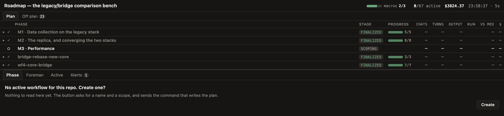
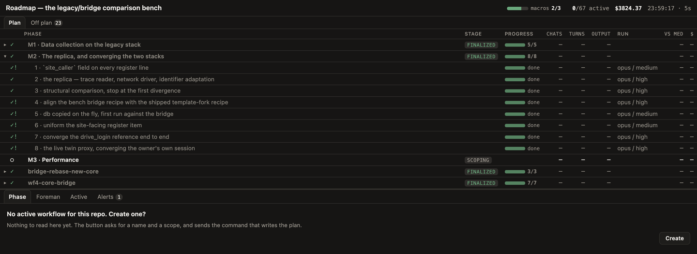
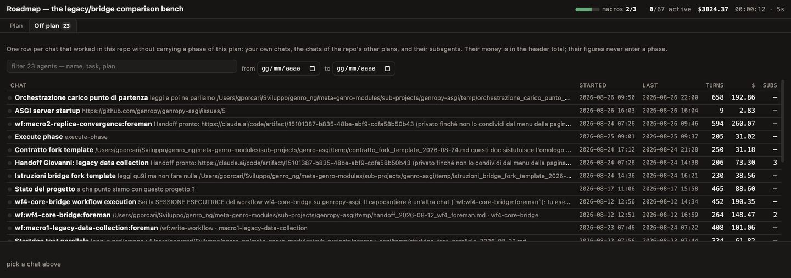
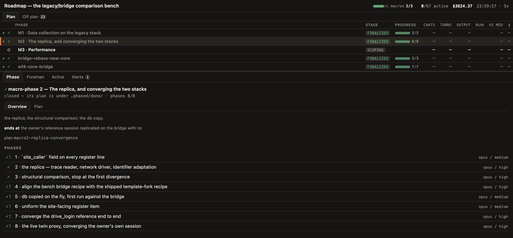
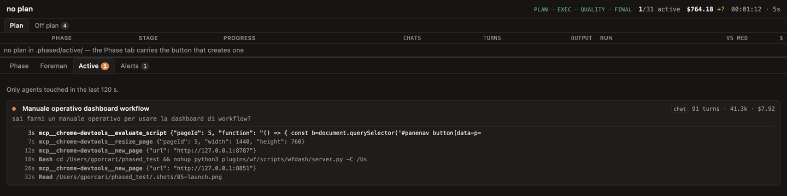
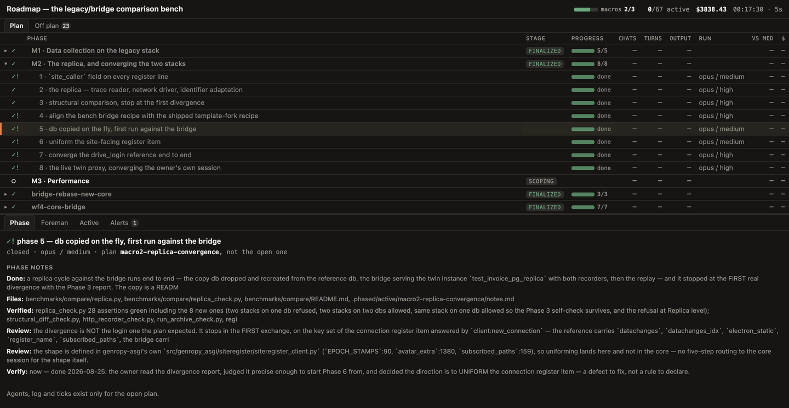
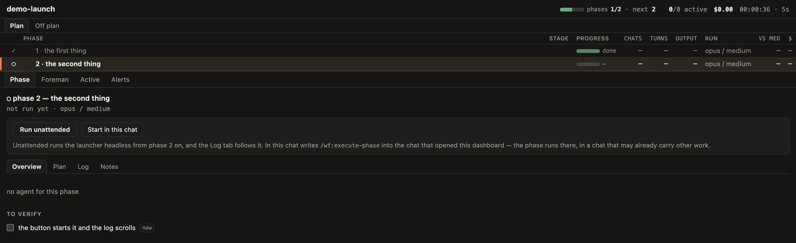
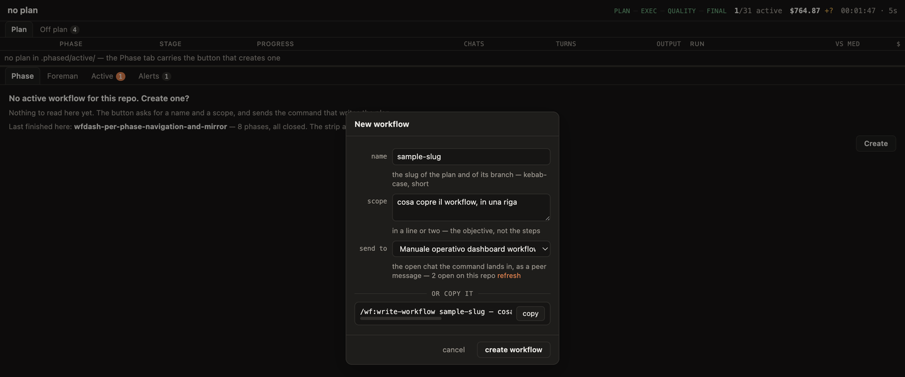
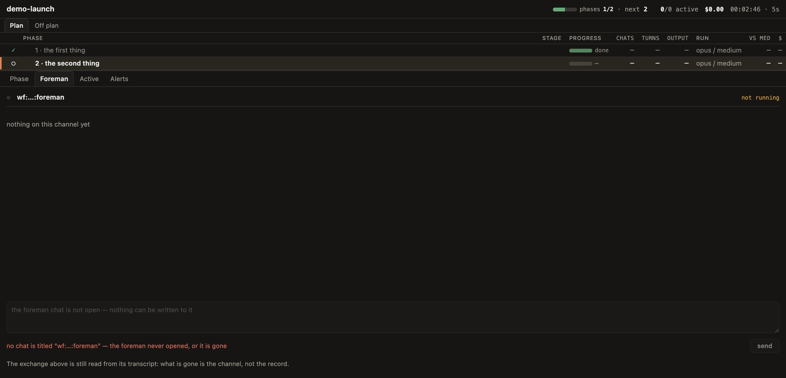

# wfdash — the dashboard of a phased workflow

An **optional** surface. Everything the dashboard shows, the textual report of
`/wf:resume-workflow` also says, and no skill of the plugin needs the page to
carry a workflow forward: no server, no `python3`, no browser pane means the
report as it always was, plus one line saying the dashboard was not opened.

The page **proposes and the chat acts**. Its buttons queue a request that the
`/wf:dashboard` skill drains into the skill that owns the work — a run still
goes through `/wf:run-workflow`, a message to the foreman still through
`refs/foreman.md`. The server itself is read-only on the repository: it writes
nothing under `.phased/` and nothing in the working tree.

## Opening it

```
/wf:dashboard
```

The skill finds the repository root, reuses a server already watching it or
starts one, and opens the page in the Browser pane beside the session. It
reports the port, the repository and the `kill <pid>` that closes it. The server
is detached on purpose: a dashboard is watched while the work goes on, so it
outlives the turn that started it.

By hand:

```bash
python3 plugins/wf/scripts/wfdash/server.py -C <repo> [-O <chat pid>] [-P <port>]
```

| Flag | Meaning |
|---|---|
| `-C` | the repository to watch (default: cwd) |
| `-O` | pid of the chat that opened the dashboard — the queue is drained there, and the *New workflow* dialog names it |
| `-P` | bind exactly this port, for a caller that must predict the address; without it, the first free port from 8787 up, which is what lets several repositories be watched at once |

The first line printed is the whole address, one-shot key included:

```
wfdash on http://127.0.0.1:8787/?k=<one-shot>  repo: /path/to/repo
```

Read the port from that line — it is not known in advance. The `?k=` is spent on
the first request and exchanged for an `HttpOnly` cookie, so it authenticates
exactly one navigation; from the second load on the address bar carries no key.
A server reused from an earlier `/wf:dashboard` has no one-shot left to hand
out, and a second pane on it is refused: the page already open holds the cookie.



## The perimeter

- bound to `127.0.0.1`, never to an interface
- **every** request is authenticated, reads included — cookie or
  `X-Wfdash-Token` header, one token behind both
- writes additionally check `Origin` against the local hosts, and cap the body
- no token in the page: there is no `<meta>` slot to read it out of

Another process on the machine cannot read the state and cannot write, even
knowing the port.

## Reading the page

**Header** — the slug, phases closed of total, lifetime, active agents, dollars
spent. A `+?` on the cost means a model whose price the board does not know.

**Grid** — one row per phase, its status mark, the agents that ran it and what
each cost. Clicking a row opens it in the *Phase* pane.



**Above the grid**: *Plan* and *Off plan*. Off plan collects the sessions that
worked in this repository outside any phase — searchable, and filterable by
date.



**Panes**, under the grid:

| Pane | What it carries |
|---|---|
| *Phase* | Overview, Plan text, the phase log, the notes — plus the launch proposals on the phase the plan computes as next |
| *Foreman* | the supervision chat as the dashboard sees it, with a box to draft a message to it |
| *Active* | the live agents: turns, tokens, model, tool trail, and their own todo list as an estimate |
| *Alerts* | what needs attention, errors first |





A finalized workflow is found in `.phased/done/<slug>/`, and a plan still living
only on its `wf/` branch is read with `git show` — so a phase can be inspected
from the branch that carries it, without checking it out.



## What the buttons do

Nothing is spawned from the server process. A button queues a request that the
`/wf:dashboard` skill drains and hands to the owning skill — except the phase
command, which is queued nowhere and comes back as text.

| Button | Queued as | Served by |
|---|---|---|
| *Ask for an unattended run* | `run-workflow` | `/wf:run-workflow` — it owns the pre-flight, the monitor, the push policy and the foreman relay |
| *Command for phase N* | nothing at all — the command comes back as text | `/wf:execute-phase`, copied into a chat of its own: a phase never runs in the chat that supervises it |
| *queue*, in the *Foreman* pane | `foreman` | `refs/foreman.md`, the plugin's only channel to the supervision chat |
| *Create*, in the *Phase* pane with no plan | `write-workflow` | `/wf:write-workflow`, run by the chat that drains the queue |

Neither launch proposal carries a phase number: the phase is whatever the plan
declares next.





A queue nobody drains is a user waiting, so the skill reads it whenever the user
says they pressed something and at the end of any turn spent on the workflow.
Two presses of the same button are one intent, served once.

## Reading, not deciding

The *to verify* list is the phase's own `Verify:` steps, read out of the plan
with their *when* and shown as text: no checkbox, nothing recorded. The ok on a
`Verify:` step is given in the conversation, which is where `/wf:close-phase`
looks for it.

With no supervision chat the *Foreman* pane says so and the box is disabled: the
recipient is the chat `foreman.json` names, resolved by the server so a dead
target is refused now rather than in the chat that would serve it.



## Limits

- macOS and Linux (WSL included): `python3` under that name, and the same host
  toolchain the rest of the plugin assumes.
- The page polls every 5 s; it is a view of the state on disk, never a live
  stream.
- The agents' todo lists are an **estimate** read from
  `~/.claude/tasks/<sessionId>/N.json`, a surface no contract covers.
- The page never delivers to the foreman itself: it queues, and the chat that
  drains the queue sends. The *Foreman* pane reads the exchange back out of the
  foreman's own transcript, so a reply shows there rather than as an answer to
  the request.
- Costs are computed from the transcripts against a known price table; an
  unpriced model shows as `+?` instead of a wrong number.
- One server per repository. A second one is a second page saying the same
  thing.
